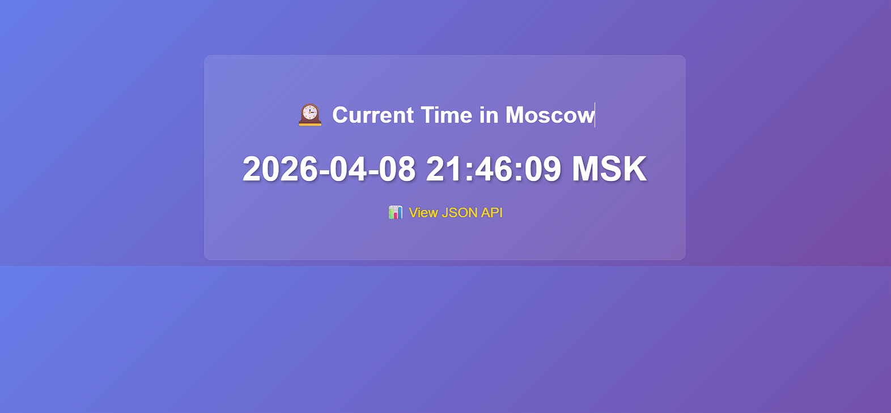
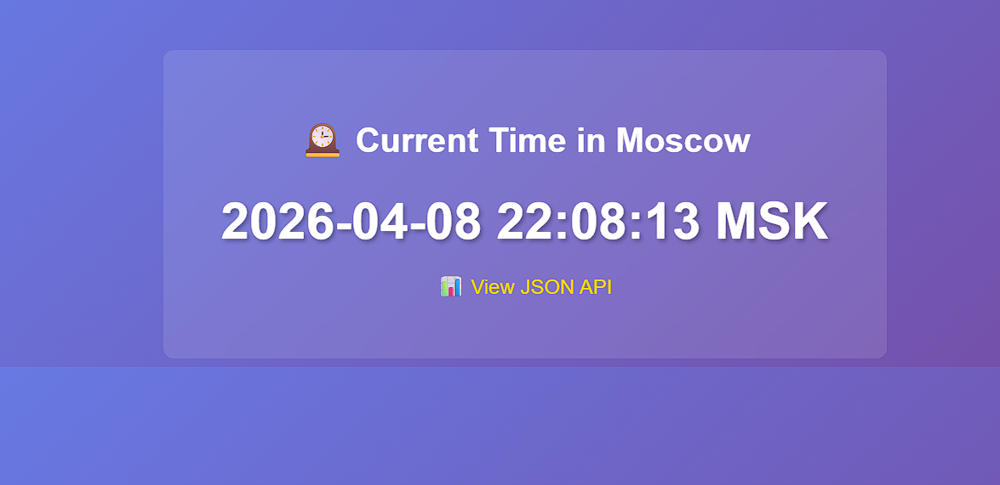

## Preparation

All work for this lab was done on the Ubuntu server directly in `labs/lab12/`.

First, I checked that the lab directory and all required files were already present.

### Check lab directory

```bash
cd /root/labs/lab12
ls -la
````

Output:

```text
total 24
drwxr-xr-x 2 root root 4096 Apr  8 08:59 .
drwxr-xr-x 4 root root 4096 Apr  8 08:58 ..
-rw-r--r-- 1 root root  432 Apr  8 08:59 Dockerfile
-rw-r--r-- 1 root root   79 Apr  8 08:59 Dockerfile.wasm
-rw-r--r-- 1 root root 3456 Apr  8 08:59 main.go
-rw-r--r-- 1 root root  305 Apr  8 08:59 spin.toml
```

This confirmed that the lab files were already available:

* `main.go`
* `Dockerfile`
* `Dockerfile.wasm`
* `spin.toml`

### Check installed tooling

I also verified that the required container tooling was available on the server.

```bash
docker --version
containerd --version
ctr version
```

Output:

```text
Docker version 28.5.2, build ecc6942
containerd containerd.io v1.7.28 b98a3aace656320842a23f4a392a33f46af97866
Client:
  Version:  v1.7.28
  Revision: b98a3aace656320842a23f4a392a33f46af97866
  Go version: go1.24.9

Server:
  Version:  v1.7.28
  Revision: b98a3aace656320842a23f4a392a33f46af97866
  UUID: 23b78f2a-9585-43f1-92bc-e86ada0f9c8f
```

### Install missing packages

Before preparing the WASM workflow, I installed the helper packages needed for downloading, unpacking, and verifying binaries.

```bash
apt-get update
apt-get install -y ca-certificates curl jq file time git golang-go tar gzip unzip
```

Output:

```text
Hit:1 https://deb.nodesource.com/node_20.x nodistro InRelease
Hit:2 https://download.docker.com/linux/ubuntu noble InRelease
Hit:3 http://security.ubuntu.com/ubuntu noble-security InRelease
Hit:4 http://nova.clouds.archive.ubuntu.com/ubuntu noble InRelease
Hit:5 http://nova.clouds.archive.ubuntu.com/ubuntu noble-updates InRelease
Hit:6 http://nova.clouds.archive.ubuntu.com/ubuntu noble-backports InRelease
Reading package lists... Done
Reading package lists... Done
Building dependency tree... Done
Reading state information... Done
ca-certificates is already the newest version (20240203).
curl is already the newest version (8.5.0-2ubuntu10.8).
jq is already the newest version (1.7.1-3ubuntu0.24.04.1).
file is already the newest version (1:5.45-3build1).
time is already the newest version (1.9-0.2build1).
git is already the newest version (1:2.43.0-1ubuntu7.3).
golang-go is already the newest version (2:1.22~2build1).
tar is already the newest version (1.35+dfsg-3build1).
gzip is already the newest version (1.12-1ubuntu3.1).
unzip is already the newest version (6.0-28ubuntu4.1).
0 upgraded, 0 newly installed, 0 to remove and 183 not upgraded.
```

### Install the Wasmtime shim for containerd

To prepare the WASM container runtime, I downloaded the prebuilt `containerd-shim-wasmtime-v1` binary from the runwasi release and installed it into `/usr/local/bin/`.

```bash
curl -fL "https://github.com/containerd/runwasi/releases/download/containerd-shim-wasmtime/v0.6.0/containerd-shim-wasmtime-x86_64-linux-musl.tar.gz" -o containerd-shim-wasmtime-x86_64-linux-musl.tar.gz
tar -xzf containerd-shim-wasmtime-x86_64-linux-musl.tar.gz
install -m 0755 containerd-shim-wasmtime-v1 /usr/local/bin/containerd-shim-wasmtime-v1
ls -l /usr/local/bin/containerd-shim-wasmtime-v1
```

Output:

```text
Downloading: https://github.com/containerd/runwasi/releases/download/containerd-shim-wasmtime/v0.6.0/containerd-shim-wasmtime-x86_64-linux-musl.tar.gz
  % Total    % Received % Xferd  Average Speed   Time    Time     Time  Current
100  9.8M  100  9.8M    0     0   474k      0  0:00:21  0:00:21 --:--:-- 1222k

-rwxr-xr-x 1 root root 28765376 Apr  8 18:29 /usr/local/bin/containerd-shim-wasmtime-v1
```

### Verify that the WASM runtime works with `ctr`

After installing the shim, I pulled the demo WASM image and tested it with `ctr`.

```bash
ctr images pull ghcr.io/containerd/runwasi/wasi-demo-app:latest
ctr run --rm --runtime=io.containerd.wasmtime.v1 ghcr.io/containerd/runwasi/wasi-demo-app:latest testwasm
```

Output:

```text
ghcr.io/containerd/runwasi/wasi-demo-app:latest:                                  resolved       |++++++++++++++++++++++++++++++++++++++|
manifest-sha256:1a5ef678e7425a98de8166d9e289e09e21d8a82312ad7e5c8bf9b961bb1f2666: done           |++++++++++++++++++++++++++++++++++++++|
layer-sha256:5e274030b46dbf5e38a5443ccb220d1023a0a9d1f654fa733c2b3dba62ae98ac:    done           |++++++++++++++++++++++++++++++++++++++|
config-sha256:329a0ea93324142d5c7af24210a3d9a20642157e9d427be98f775e130a0f59eb:   done           |++++++++++++++++++++++++++++++++++++++|
elapsed: 1.6 s                                                                    total:  2.2 Mi (1.3 MiB/s)
unpacking linux/amd64 sha256:1a5ef678e7425a98de8166d9e289e09e21d8a82312ad7e5c8bf9b961bb1f2666...
done: 132.197574ms

This is a song that never ends.
Yes, it goes on and on my friends.
Some people started singing it not knowing what it was,
So they'll continue singing it forever just because...

This is a song that never ends.
Yes, it goes on and on my friends.
Some people started singing it not knowing what it was,
So they'll continue singing it forever just because...

...
```

The demo application kept running and printing output continuously, which showed that the Wasmtime-based runtime path was working.

To make the verification shorter and cleaner, I ran the same image again with an explicit `echo` command:

```bash
ctr run --rm \
  --runtime=io.containerd.wasmtime.v1 \
  ghcr.io/containerd/runwasi/wasi-demo-app:latest testwasm-echo \
  /wasi-demo-app.wasm echo hello
```

Output:

```text
hello
exiting
```

This was the final confirmation that `ctr` + `io.containerd.wasmtime.v1` worked correctly on the server.

### Install Spin for the bonus WASM server mode

For the bonus part, I also installed Spin.

```bash
curl -fsSL https://developer.fermyon.com/downloads/install.sh | bash
install -m 0755 /root/spin /usr/local/bin/spin
spin --version
```

Output:

```text
Step 1: Downloading: https://github.com/spinframework/spin/releases/download/v3.6.2/spin-v3.6.2-linux-amd64.tar.gz
Done...

Step 2: Decompressing: spin-v3.6.2-linux-amd64.tar.gz
crt.pem
spin.sig
README.md
LICENSE
spin
spin 3.6.2 (c0fc970 2026-02-25)
Done...

Step 3: Removing the downloaded tarball
Done...

Step 4: Installing default templates
Copying remote template source
Installing template http-grain...
Installing template http-rust...
Installing template http-zig...
Installing template static-fileserver...
Installing template http-php...
Installing template redis-rust...
Installing template http-rust-wasip3-unstable...
Installing template http-empty...
Installing template redis-go...
Installing template http-go...
Installing template http-c...
Installing template redirect...
Installed 12 template(s)

+------------------------------------------------------------------------------------------+
| Name                        Description                                                  |
+==========================================================================================+
| http-c                      HTTP request handler using C and the Zig toolchain           |
| http-empty                  HTTP application with no components                          |
| http-go                     HTTP request handler using (Tiny)Go                          |
| http-grain                  HTTP request handler using Grain                             |
| http-php                    HTTP request handler using PHP                               |
| http-rust                   HTTP request handler using Rust                              |
| http-rust-wasip3-unstable   WASIp3 HTTP request handler using Rust (0.3.0-rc-2025-09-16) |
| http-zig                    HTTP request handler using Zig                               |
| redirect                    Redirects a HTTP route                                       |
| redis-go                    Redis message handler using (Tiny)Go                         |
| redis-rust                  Redis message handler using Rust                             |
| static-fileserver           Serves static files from an asset directory                  |
+------------------------------------------------------------------------------------------+

Copying remote template source
Installing template http-py...
Installed 1 template(s)

+---------------------------------------------+
| Name      Description                       |
+=============================================+
| http-py   HTTP request handler using Python |
+---------------------------------------------+

Copying remote template source
Installing template http-ts...
Installing template redis-js...
Installing template http-js...
Installing template redis-ts...
Installed 4 template(s)

+---------------------------------------------------+
| Name       Description                            |
+===================================================+
| http-js    HTTP request handler using JavaScript  |
| http-ts    HTTP request handler using TypeScript  |
| redis-js   Redis message handler using JavaScript |
| redis-ts   Redis message handler using TypeScript |
+---------------------------------------------------+

Step 5: Installing default plugins
Plugin information updated successfully
Plugin 'cloud' was installed successfully!

Description:
        Commands for publishing applications to the Fermyon Cloud.

Homepage:
        https://github.com/fermyon/cloud-plugin
You're good to go. Check here for the next steps: https://spinframework.dev/quickstart
Run './spin' to get started

spin 3.6.2 (c0fc970 2026-02-25)
```

### Final readiness check

Finally, I verified that Spin was installed, the WASM demo worked with `ctr`, and the lab files were still present.

```bash
spin --version
ctr run --rm --runtime=io.containerd.wasmtime.v1 ghcr.io/containerd/runwasi/wasi-demo-app:latest testwasm-echo /wasi-demo-app.wasm echo hello
cd /root/labs/lab12 && ls -la
```

Output:

```text
spin 3.6.2 (c0fc970 2026-02-25)
hello
exiting

total 24
drwxr-xr-x 2 root root 4096 Apr  8 08:59 .
drwxr-xr-x 4 root root 4096 Apr  8 08:58 ..
-rw-r--r-- 1 root root  432 Apr  8 08:59 Dockerfile
-rw-r--r-- 1 root root   79 Apr  8 08:59 Dockerfile.wasm
-rw-r--r-- 1 root root 3456 Apr  8 08:59 main.go
-rw-r--r-- 1 root root  305 Apr  8 08:59 spin.toml
```

At this point, the environment was ready for:

* traditional Docker build and benchmark,
* WASM build and execution with `ctr`,
* optional local or cloud Spin testing for the bonus task.


## Task 1 — Create the Moscow Time Application

I worked directly in `labs/lab12/` as required.

### 1.1 Navigate to the lab directory

```bash
cd /root/labs/lab12
pwd
ls -la
````

Output:

```text
/root/labs/lab12
total 24
drwxr-xr-x 2 root root 4096 Apr  8 08:59 .
drwxr-xr-x 4 root root 4096 Apr  8 08:58 ..
-rw-r--r-- 1 root root  432 Apr  8 08:59 Dockerfile
-rw-r--r-- 1 root root   79 Apr  8 08:59 Dockerfile.wasm
-rw-r--r-- 1 root root 3456 Apr  8 08:59 main.go
-rw-r--r-- 1 root root  305 Apr  8 08:59 spin.toml
```

This confirmed that I was working in the correct lab directory and that all reference files were already present.

### 1.2 Review the provided Go application

I reviewed `main.go` and verified that the same file supports three execution modes:

* CLI mode with `MODE=once`
* traditional HTTP server mode with `net/http`
* WAGI mode for Spin using CGI-style environment variables

The code uses `time.FixedZone("MSK", 3*60*60)` to avoid relying on external timezone databases, which is useful for minimal WASM environments.

The WAGI detection is implemented through:

```go
func isWagi() bool {
    return os.Getenv("REQUEST_METHOD") != ""
}
```

If `REQUEST_METHOD` is present, the program handles one request through `runWagiOnce()` and writes the response to standard output. Otherwise, it falls back to the normal `net/http` server. For benchmarking, the program also has a one-shot CLI mode:

```go
if os.Getenv("MODE") == "once" {
    b, _ := json.MarshalIndent(getMoscowTime(), "", "  ")
    fmt.Println(string(b))
    return
}
```

So the same `main.go` works in three contexts without changing the source file:

* native server mode in Docker,
* one-shot CLI mode for Docker and WASM benchmarking,
* Spin WAGI mode for WASM HTTP handling.

### 1.3 Test CLI mode

Command:

```bash
MODE=once go run main.go
```

Output:

```text
{
  "moscow_time": "2026-04-08 21:45:25 MSK",
  "timestamp": 1775673925
}
```

This shows that CLI mode works correctly and prints a single JSON response before exiting.

### 1.4 Test server mode

To test the normal HTTP server mode, I started the application in the background and queried both the HTML page and the JSON API with `curl`.

Commands:

```bash
nohup go run main.go > /tmp/lab12_server.log 2>&1 &
SERVER_PID=$!
sleep 3

curl -i http://127.0.0.1:8080/ | sed -n '1,40p'
curl -i http://127.0.0.1:8080/api/time | sed -n '1,40p'
sed -n '1,40p' /tmp/lab12_server.log

kill $SERVER_PID
wait $SERVER_PID 2>/dev/null || true
```

Output for `/`:

```text
HTTP/1.1 200 OK
Content-Type: text/html; charset=utf-8
Date: Wed, 08 Apr 2026 18:45:29 GMT
Content-Length: 1221

<!DOCTYPE html>
<html>
<head>
  <title>Moscow Time</title>
  <style>
    body { font-family: Arial, sans-serif; text-align: center; margin-top: 100px;
           background: linear-gradient(135deg,#667eea 0%,#764ba2 100%); color: white; }
    .container { background: rgba(255,255,255,.1); padding: 40px; border-radius: 10px;
                 backdrop-filter: blur(10px); max-width: 600px; margin: 0 auto; }
    h1 { margin-bottom: 30px; }
    #time { font-size: 3em; font-weight: bold; margin: 20px 0; text-shadow: 2px 2px 4px rgba(0,0,0,.3); }
    a { color:#ffd700; text-decoration:none; font-size:1.2em; }
    a:hover { text-decoration: underline; }
  </style>
</head>
<body>
  <div class="container">
    <h1>🕰️ Current Time in Moscow</h1>
    <div id="time">Loading...</div>
    <p><a href="/api/time">📊 View JSON API</a></p>
  </div>
  <script>
    async function updateTime(){
      try{
        const r=await fetch('/api/time'); const d=await r.json();
        document.getElementById('time').textContent=d.moscow_time;
      }catch(e){ console.error(e); document.getElementById('time').textContent='Error loading time'; }
    }
    updateTime(); setInterval(updateTime,1000);
  </script>
</body>
</html>
```

Output for `/api/time`:

```text
HTTP/1.1 200 OK
Content-Type: application/json
Date: Wed, 08 Apr 2026 18:45:29 GMT
Content-Length: 65

{"moscow_time":"2026-04-08 21:45:29 MSK","timestamp":1775673929}
```

Server log:

```text
nohup: ignoring input
2026/04/08 18:45:26 Server starting on :8080
```

This confirmed that server mode works correctly:

* `/` returns the HTML page
* `/api/time` returns the JSON response

### 1.5 Browser test

I also tested the page through an SSH port forward and opened it in the browser. The page rendered correctly and showed the current Moscow time.

Command used for port forwarding on the local machine:

```powershell
ssh -L 8080:127.0.0.1:8080 -i C:\Users\batsi\.ssh\serv1 root@95.182.115.130
```

Then on the server:

```bash
cd /root/labs/lab12
go run main.go
```

When I tried to start it again, I got:

```text
2026/04/08 18:45:56 Server starting on :8080
2026/04/08 18:45:56 listen tcp :8080: bind: address already in use
exit status 1
```

This happened because the application was already running on port `8080` from the earlier test. So the second start failed for the expected reason: the port was already occupied.

The browser screenshot:





### Result

Task 1 is completed.

I confirmed that:

* the work was done directly in `labs/lab12/`
* `main.go` supports CLI mode, traditional server mode, and WAGI mode
* CLI mode works with `MODE=once`
* server mode works and serves both HTML and JSON
* the page was also opened successfully in the browser

## Task 2 — Build Traditional Docker Container

### 2.1 Review the provided Dockerfile

I reviewed the provided `Dockerfile`.

```bash
sed -n '1,220p' Dockerfile
```

Output:

```text
# Build stage
FROM golang:1.21-alpine AS builder

WORKDIR /app
COPY main.go .

# Build static binary (no CGO, for scratch base)
RUN CGO_ENABLED=0 GOOS=linux \
    go build -tags netgo -trimpath \
    -ldflags="-s -w -extldflags=-static" \
    -o moscow-time main.go

# Run stage - minimal scratch image
FROM scratch

WORKDIR /app
COPY --from=builder /app/moscow-time .

EXPOSE 8080
ENTRYPOINT ["/app/moscow-time"]
```

The Dockerfile uses a two-stage build. The first stage compiles the Go application, and the second stage uses `scratch` as the runtime image. The binary is built as a static executable using `CGO_ENABLED=0`, `-tags netgo`, `-trimpath`, and stripped linker flags, which keeps the final image minimal.

### 2.2 Clean up and build the traditional image

Before building, I cleaned old test containers and dangling images.

```bash
docker rm -f test-traditional test-wasm temp-traditional 2>/dev/null || true
docker image prune -f 2>/dev/null || true
```

Output:

```text
Total reclaimed space: 0B
```

Then I built the image:

```bash
docker build -t moscow-time-traditional -f Dockerfile .
```

Output:

```text
[+] Building 47.5s (12/12) FINISHED                        docker:default
 => [internal] load build definition from Dockerfile                 0.0s
 => => transferring dockerfile: 471B                                 0.0s
 => [internal] load metadata for docker.io/library/golang:1.21-alpine  1.5s
 => [auth] library/golang:pull token for registry-1.docker.io        0.0s
 => [internal] load .dockerignore                                    0.0s
 => => transferring context: 2B                                      0.0s
 => [builder 1/4] FROM docker.io/library/golang:1.21-alpine@sha256... 13.1s
 => [internal] load build context                                    0.0s
 => => transferring context: 3.49kB                                  0.0s
 => [stage-1 1/2] WORKDIR /app                                       0.0s
 => [builder 2/4] WORKDIR /app                                       0.5s
 => [builder 3/4] COPY main.go .                                     0.1s
 => [builder 4/4] RUN CGO_ENABLED=0 GOOS=linux     go build -tags... 32.0s
 => [stage-1 2/2] COPY --from=builder /app/moscow-time .             0.1s
 => exporting to image                                               0.1s
 => => exporting layers                                              0.1s
 => => writing image sha256:b032d297d0eaa968306165cfa1705d9ba97ebf6...
 => => naming to docker.io/library/moscow-time-traditional           0.0s
```

The image was built successfully.

### 2.3 Test CLI mode

I tested the traditional container in one-shot CLI mode.

```bash
docker run --rm -e MODE=once moscow-time-traditional
```

Output:

```text
{
  "moscow_time": "2026-04-08 22:07:34 MSK",
  "timestamp": 1775675254
}
```

This confirmed that the container works correctly in CLI mode.

### 2.4 Extract the binary and check its size

I extracted the compiled binary from the image and inspected it.

```bash
rm -f ./moscow-time-traditional
docker create --name temp-traditional moscow-time-traditional
docker cp temp-traditional:/app/moscow-time ./moscow-time-traditional
docker rm temp-traditional
ls -lh ./moscow-time-traditional
file ./moscow-time-traditional
```

Output:

```text
25762126e28d830993626be9b5650c37f88cd0f971561038763b7d62dadebb92
Successfully copied 4.7MB to /root/labs/lab12/moscow-time-traditional
temp-traditional
-rwxr-xr-x 1 root root 4.5M Apr  8 19:07 ./moscow-time-traditional
./moscow-time-traditional: ELF 64-bit LSB executable, x86-64, version 1 (SYSV), statically linked, Go BuildID=9yOTgsxnfzxr9ebtgoVB/diVLw-eVB_V2gSbIyHTU/ILU9qTDEwX5qS6oMqdUw/eZ2Q8AdFMg0caoH9xPnp, stripped
```

So the traditional Linux binary size is **4.5 MB**.

### 2.5 Check image size

I measured the final image size using both `docker images` and `docker image inspect`.

```bash
docker images moscow-time-traditional
docker image inspect moscow-time-traditional --format '{{.Size}}' | awk '{print $1/1024/1024 " MB"}'
```

Output:

```text
REPOSITORY                TAG       IMAGE ID       CREATED         SIZE
moscow-time-traditional   latest    b032d297d0ea   2 seconds ago   4.7MB
4.48047 MB
```

So the final image size is about **4.7 MB**, and the more precise reported size is **4.48047 MB**.

### 2.6 Startup time benchmark

I benchmarked startup time in CLI mode across five runs.

```bash
for i in 1 2 3 4 5; do
  /usr/bin/time -f "%e" sh -c 'docker run --rm -e MODE=once moscow-time-traditional >/dev/null' 2>&1
done | awk '{sum+=$1; count++} END {print "Average:", sum/count, "seconds"}'
```

Output:

```text
Average: 0.56 seconds
```

So the average startup time for the traditional container in CLI mode was **0.56 seconds**.


### 2.7 Server mode check

For the final server-mode check, I ran the container on a free host port to avoid conflicts with other services already using `8080`.

```bash
pkill -f "go run main.go" 2>/dev/null || true
docker rm -f test-traditional 2>/dev/null || true
sleep 2

docker run -d --rm --name test-traditional -p 18080:8080 moscow-time-traditional
sleep 3
````

Output:

```text
17a7d6a0aafd06ad913c72023fb391b3c4ce6cfb33622242fabe1f464d856340
```

Then I verified that the container was running and checked both HTTP endpoints.

```bash
docker ps --filter name=test-traditional
docker images moscow-time-traditional
curl -i http://127.0.0.1:18080/ | sed -n '1,25p'
curl -i http://127.0.0.1:18080/api/time | sed -n '1,25p'
docker stats test-traditional --no-stream
docker logs test-traditional 2>&1 | sed -n '1,25p'
```

Container state:

```text
CONTAINER ID   IMAGE                     COMMAND              CREATED         STATUS         PORTS                                           NAMES
17a7d6a0aafd   moscow-time-traditional   "/app/moscow-time"   3 seconds ago   Up 3 seconds   0.0.0.0:18080->8080/tcp, [::]:18080->8080/tcp   test-traditional
REPOSITORY                TAG       IMAGE ID       CREATED         SIZE
moscow-time-traditional   latest    e6cf42cf05ba   6 seconds ago   4.7MB
```

Output for `/`:

```text
HTTP/1.1 200 OK
Content-Type: text/html; charset=utf-8
Date: Thu, 09 Apr 2026 10:23:50 GMT
Content-Length: 1221

<!DOCTYPE html>
<html>
<head>
  <title>Moscow Time</title>
  <style>
    body { font-family: Arial, sans-serif; text-align: center; margin-top: 100px;
           background: linear-gradient(135deg,#667eea 0%,#764ba2 100%); color: white; }
    .container { background: rgba(255,255,255,.1); padding: 40px; border-radius: 10px;
                 backdrop-filter: blur(10px); max-width: 600px; margin: 0 auto; }
    h1 { margin-bottom: 30px; }
    #time { font-size: 3em; font-weight: bold; margin: 20px 0; text-shadow: 2px 2px 4px rgba(0,0,0,.3); }
    a { color:#ffd700; text-decoration:none; font-size:1.2em; }
    a:hover { text-decoration: underline; }
  </style>
</head>
<body>
  <div class="container">
    <h1>🕰️ Current Time in Moscow</h1>
    <div id="time">Loading...</div>
    <p><a href="/api/time">📊 View JSON API</a></p>
```

Output for `/api/time`:

```text
HTTP/1.1 200 OK
Content-Type: application/json
Date: Thu, 09 Apr 2026 10:23:50 GMT
Content-Length: 65

{"moscow_time":"2026-04-09 13:23:50 MSK","timestamp":1775730230}
```

Memory usage from `docker stats`:

```text
CONTAINER ID   NAME               CPU %     MEM USAGE / LIMIT    MEM %     NET I/O           BLOCK I/O   PIDS
17a7d6a0aafd   test-traditional   0.00%     1.09MiB / 3.824GiB   0.03%     1.76kB / 2.22kB   0B / 0B     4
```

Container log:

```text
2026/04/09 10:23:47 Server starting on :8080
```

This confirmed that the traditional container worked correctly in server mode on port `18080`, and the memory usage was captured successfully from `docker stats`.

### 2.8 Browser screenshot

I also opened the containerized application in the browser through an SSH tunnel using the final server-mode run on port `18080`.



### Result

Task 2 is completed.

The traditional Docker image was built successfully. The CLI mode worked correctly, the extracted static binary size was **4.5 MB**, the image size was about **4.7 MB**, and the average startup time across five runs was **0.56 seconds**. In the final server-mode run, the container served both the HTML page and the JSON API correctly on port `18080`, and memory usage was captured successfully from `docker stats`.


## Task 3 — Build WASM Container (ctr-based)

### 3.1 Capture TinyGo version

I first recorded the TinyGo build environment.

```bash
cd /root/labs/lab12
docker run --rm tinygo/tinygo:0.39.0 tinygo version
````

Output:

```text id="bq4fjw"
tinygo version 0.39.0 linux/amd64 (using go version go1.25.0 and LLVM version 19.1.2)
```

### 3.2 Build the WASM binary from the same `main.go`

I used the same `main.go` file as in the traditional Docker build and compiled it to WASI WebAssembly using TinyGo.

```bash
mkdir -p /dev/shm/lab12-tmp

docker run --rm \
  --user 0:0 \
  -e TMPDIR=/tmp \
  -v /dev/shm/lab12-tmp:/tmp \
  -v "$(pwd):/src" \
  -w /src \
  tinygo/tinygo:0.39.0 \
  tinygo build -o main.wasm -target=wasi main.go
```

Then I verified the produced WASM binary.

```bash
ls -lh main.wasm
file main.wasm
```

Output:

```text id="r2io5m"
-rwxr-xr-x 1 root root 2.4M Apr  9 07:42 main.wasm
main.wasm: WebAssembly (wasm) binary module version 0x1 (MVP)
```

This confirmed that the same application source was successfully compiled into a WASM module.

### 3.3 Review the WASM Dockerfile

I reviewed the provided `Dockerfile.wasm`.

```bash
sed -n '1,120p' Dockerfile.wasm
```

Output:

```text id="s6e5m1"
FROM scratch
COPY main.wasm /main.wasm
EXPOSE 8080
ENTRYPOINT ["/main.wasm"]
```

The image is minimal: it starts from `scratch`, copies only the `main.wasm` file, and uses the WASM module itself as the entry point.

### 3.4 Build OCI archive and import it into containerd

I used Docker Buildx with the `docker-container` builder to create an OCI archive for the WASM image.

```bash
docker buildx use lab12builder
docker buildx inspect --bootstrap

docker buildx build \
  --builder lab12builder \
  --platform=wasi/wasm \
  --provenance=false \
  -f Dockerfile.wasm \
  --output type=oci,dest=moscow-time-wasm.oci \
  .
```

Output:

```text id="gzqxh1"
[+] Building 0.6s (5/5) FINISHED             docker-container:lab12builder
 => [internal] load build definition from Dockerfile.wasm             0.0s
 => => transferring dockerfile: 121B                                  0.0s
 => [internal] load .dockerignore                                     0.0s
 => => transferring context: 2B                                       0.0s
 => [internal] load build context                                     0.1s
 => => transferring context: 2.45MB                                   0.1s
 => [1/1] COPY main.wasm /main.wasm                                   0.0s
 => exporting to oci image format                                     0.3s
 => => exporting layers                                               0.3s
 => => exporting manifest sha256:730127b998404bc6bde5a1ee81f83c8791e...
 => => exporting config sha256:297db9d6da53d66f5959b5aae1867b0c887d2...
 => => sending tarball                                                0.1s
```

Then I checked the generated OCI archive:

```bash
ls -lh moscow-time-wasm.oci
file moscow-time-wasm.oci
```

Output:

```text id="f7svtc"
-rw-r--r-- 1 root root 826K Apr  9 07:42 moscow-time-wasm.oci
moscow-time-wasm.oci: POSIX tar archive
```

After that, I imported the OCI archive into containerd and verified that the image entry was visible:

```bash
ctr images import --all-platforms \
  --index-name docker.io/library/moscow-time-wasm:latest \
  moscow-time-wasm.oci

ctr images ls | grep -E 'moscow-time-wasm|wasi|wasm'
```

Output:

```text id="r2z3wr"
docker.io/library/moscow-time-wasm:latest       application/vnd.oci.image.index.v1+json    sha256:7b6bcba5c9d165bdf23add64a50740eb80f571a2bb153dd0f2cebac478b362f6 361.0 B wasi/wasm   -
ghcr.io/containerd/runwasi/wasi-demo-app:latest application/vnd.oci.image.manifest.v1+json sha256:1a5ef678e7425a98de8166d9e289e09e21d8a82312ad7e5c8bf9b961bb1f2666 2.2 MiB wasip1/wasm -
```

This confirmed that the WASM image was present in containerd and recognized as a `wasi/wasm` image.

### 3.5 Run the WASM container with `ctr`

I ran the imported image in CLI mode using `ctr`, the Wasmtime runtime shim, and `MODE=once`.

```bash
NAME="wasi-once-$(date +%s)"
ctr run --rm \
  --runtime io.containerd.wasmtime.v1 \
  --platform wasi/wasm \
  --env MODE=once \
  docker.io/library/moscow-time-wasm:latest "$NAME"
````

Output:

```text
{
  "moscow_time": "2026-04-09 13:23:55 MSK",
  "timestamp": 1775730235
}
```

This showed that the WASM container executed successfully via `ctr` and produced the same JSON output as the traditional container.

### 3.6 Record sizes

I recorded the WASM binary size and the imported image entry from `ctr`.

```bash
ls -lh main.wasm
ctr images ls | awk 'NR>1 && $1 ~ /moscow-time-wasm/ {print "IMAGE:", $1, "SIZE:", $4, "PLATFORMS:", $5}'
```

Output:

```text id="9jw6or"
-rwxr-xr-x 1 root root 2.4M Apr  9 07:42 main.wasm
IMAGE: docker.io/library/moscow-time-wasm:latest SIZE: 361.0 PLATFORMS: B
```

So the WASM binary size is **2.4 MB**. The image entry was listed successfully in containerd and associated with the `wasi/wasm` platform.

### 3.7 Startup benchmark

I benchmarked the WASM container in CLI mode across five runs.

```bash
for i in 1 2 3 4 5; do
  NAME="wasi-$(date +%s%N)-$i"
  /usr/bin/time -f "%e" sh -c "ctr run --rm --runtime io.containerd.wasmtime.v1 --platform wasi/wasm --env MODE=once docker.io/library/moscow-time-wasm:latest $NAME >/dev/null" 2>&1
done | awk '{sum+=$1; n++} END {printf("Average: %.4f seconds\n", sum/n)}'
````

Output:

```text
Average: 3.4620 seconds
```

So the average startup time for the WASM container in CLI mode was **3.4620 seconds**.


### 3.8 Server mode limitation under plain WASI

I also checked what happens if the same WASM image is started without `MODE=once`.

```bash
NAME="wasi-server-$(date +%s)"
timeout 8s ctr run --rm \
  --runtime io.containerd.wasmtime.v1 \
  --platform wasi/wasm \
  docker.io/library/moscow-time-wasm:latest "$NAME" 2>&1 | sed -n '1,40p' || true
````

Output:

```text
2026/04/09 10:23:59 Server starting on :8080
2026/04/09 10:23:59 Netdev not set
```

### 3.9 Memory usage note

Memory usage reporting for the WASM container was **N/A** in this task. Unlike the traditional Docker container in Task 2, this run used `ctr` with a WASM runtime shim, so the usual `docker stats` style reporting was not available in the same way.

### Result

Task 3 is completed.

I used the **same `main.go` source file** as in the traditional container build, compiled it to WASM with TinyGo, packaged it as an OCI archive, imported it into containerd, and ran it with `ctr` using the `io.containerd.wasmtime.v1` runtime.

The important results are:

* TinyGo version: **0.39.0**
* WASM binary size: **2.4 MB**
* OCI archive size: **826 KB**
* Imported image visible in `ctr` as a **`wasi/wasm` OCI image index**
* Average startup time in CLI mode: **3.4620 seconds**
* Plain WASI server mode under `ctr` does not support the normal HTTP server path in this setup
* The same `main.wasm` can still be used with Spin for HTTP mode


## Task 4 — Performance Comparison & Analysis

In this task I compared the traditional Docker container and the WASM container built from the same `main.go` source file.

### 4.1 Comparison table

| Metric | Traditional Container | WASM Container | Improvement | Notes |
|--------|----------------------|----------------|-------------|-------|
| **Binary Size** | 4.5 MB | 2.4 MB | **46.67% smaller** | From `ls -lh` |
| **Image Size** | 4.48047 MB | 826 KB OCI archive | **about 82.0% smaller** | Traditional size from `docker image inspect`, WASM package size from the built OCI archive |
| **Startup Time (CLI)** | 0.56 s (560 ms) | 3.4620 s (3462 ms) | **Traditional was ~6.18x faster** | Average of 5 runs |
| **Memory Usage** | 1.09MiB / 3.824GiB (0.03%) | N/A via `ctr` | N/A | `docker stats` available for Docker, not available in the same way for WASM via `ctr` |
| **Base Image** | `scratch` | `scratch` | Same | Both use a minimal base |
| **Source Code** | `main.go` | `main.go` | Identical | Same application source |
| **Server Mode** | ✅ Works with `net/http` | ❌ Not via `ctr` <br> ✅ Via Spin (WAGI) | N/A | Plain WASI runtime does not provide the normal TCP server path |

### 4.2 Improvement calculations

For binary size:

\[
\frac{4.5 - 2.4}{4.5} \times 100 \approx 46.67\%
\]

So the WASM binary is about **46.67% smaller** than the traditional Linux binary.

For packaged image size:

\[
\frac{4.48047 - 0.8066}{4.48047} \times 100 \approx 82.0\%
\]

So the OCI-packaged WASM artifact is about **82.0% smaller** than the traditional image.

For startup time:

\[
\frac{3.4620}{0.56} \approx 6.18
\]

So in this environment, the **traditional container started about 6.18x faster** than the WASM container.

### 4.3 Analysis

#### 1. Binary size comparison

The WASM binary is noticeably smaller because TinyGo produces a much lighter runtime than standard Go. The traditional build includes a full native Linux executable, while the WASM build is a compact module for the WASI target.

TinyGo optimized away a large part of the normal Go runtime and only included what was actually needed for this program. It also produced a smaller output format than a stripped native ELF binary. In practice, this means less runtime baggage, less unused standard library code, and a much smaller final artifact.

#### 2. Startup performance

In theory, WASM can have very fast startup, especially in specialized serverless or edge runtimes. In my experiment, however, the WASM container was slower.

The reason is that the measured startup path here included `ctr`, the Wasmtime shim, and WASM module instantiation on this specific host. That extra runtime setup cost was larger than the startup cost of the traditional container.

The traditional container was already very lightweight:
- static Go binary
- `scratch` base image
- no shell
- no package manager
- no extra runtime dependencies

So even though WASM was smaller, the actual end-to-end startup path through `ctr` and Wasmtime was slower in this setup.

Traditional containers still have overhead such as:
- container creation
- namespace and cgroup setup
- process start
- runtime bookkeeping

But in this lab the traditional image was so minimal that this overhead stayed low.

#### 3. Use case decision matrix

I would choose **WASM** when:
- I want a very small artifact
- I care about portability across runtimes
- the workload is short-lived and sandbox-friendly
- the application can work in CLI mode or through a host-provided HTTP abstraction such as Spin/WAGI
- I want the same binary to be reusable in edge or serverless environments

I would choose **traditional containers** when:
- I need normal networking and a standard `net/http` server
- I want fewer runtime surprises
- I need familiar observability and tooling such as `docker logs`, `docker stats`, and standard container workflows
- I am deploying to a normal Docker or Kubernetes environment
- startup latency on the target host matters more than artifact size

### 4.4 Conclusion

The most important result is that the **same `main.go` source file** worked for both targets.

The WASM build was smaller, but on this host it was not faster. So the trade-off in this lab was clear:

- **Traditional Docker** gave better startup performance, standard networking, and straightforward runtime observability.
- **WASM** gave a smaller packaged artifact and better portability to WASI-style runtimes, but it came with networking limitations under plain `ctr` execution.

For this particular application, I would use the traditional container for normal server deployment, and I would use the WASM build when targeting environments like Spin where the runtime provides the HTTP layer.
