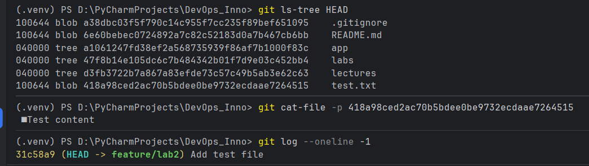
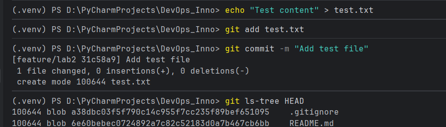
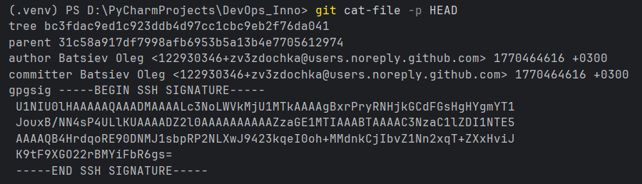
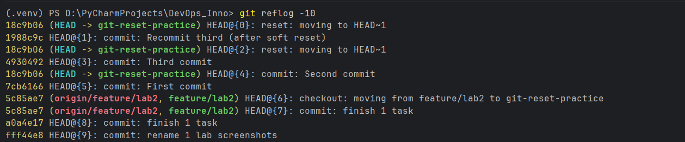
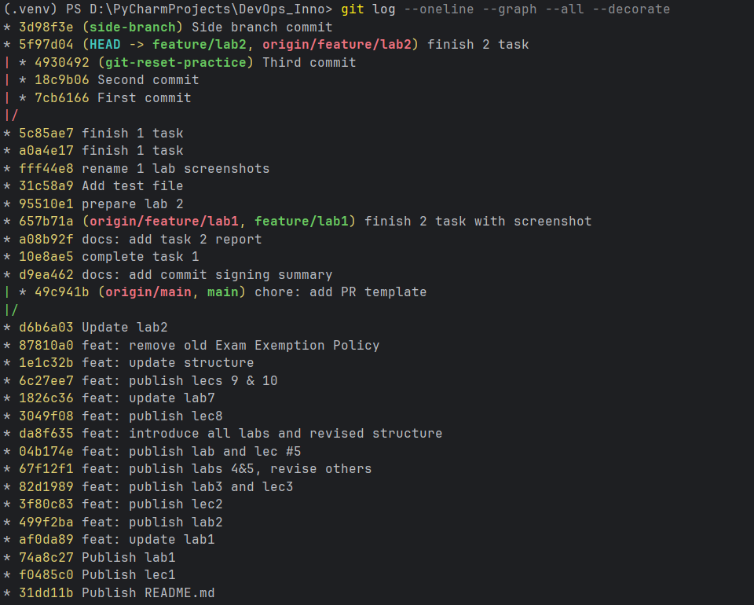
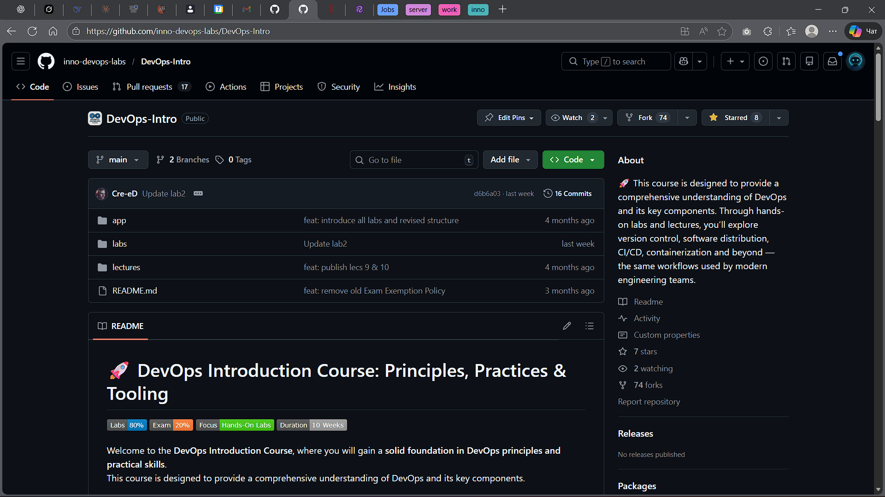
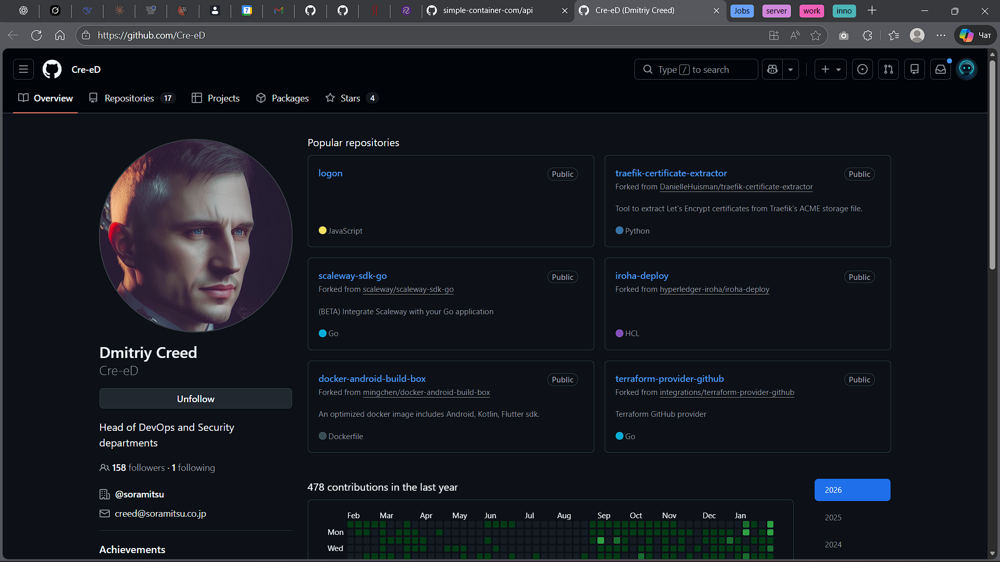
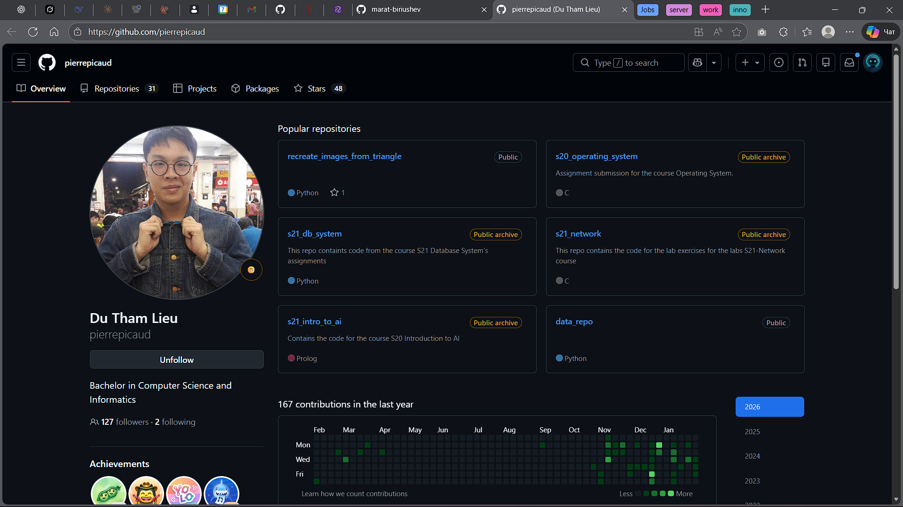
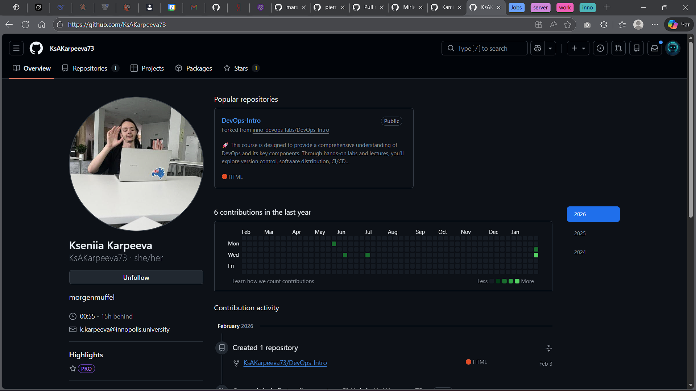

# Lab 2 — Version Control & Advanced Git

## Task 1 — Git Object Model Exploration

### What each object represents

* Blob: stores the content of a file (bytes). It does not store filename or path.
* Tree: stores a directory snapshot: filenames + file modes + pointers to blobs (files) and other trees (subdirectories).
* Commit: stores metadata (author, message, timestamp) and points to a single root tree (snapshot) plus parent commit(s).

### Analysis: how Git stores repository data

Git is a content-addressable object store: each object (blob/tree/commit) is identified by its hash.
A commit represents a full snapshot via a root tree; trees reference blobs/trees, so the repository history is a chain of snapshots linked by parent pointers.

### Commands and outputs

**Create a sample commit**
```bash
echo "Test content" > test.txt
git add test.txt
git commit -m "Add test file"
git log --oneline -1
```

```text
31c58a9 (HEAD -> feature/lab2) Add test file
```

**Inspect tree entries referenced by HEAD**

```bash
git ls-tree HEAD
```

```text
100644 blob a38dbc03f5f790c14c955f7cc235f89bef651095    .gitignore
100644 blob 6e60bebec0724892a7c82c52183d0a7b467cb6bb    README.md
040000 tree a1061247fd38ef2a568735939f86af7b1000f83c    app
040000 tree 47f8b14e105dc6c7b484342b01f7d9e03c452bb4    labs
040000 tree d3fb3722b7a867a83efde73c57c49b5ab3e62c63    lectures
100644 blob 418a98ced2ac70b5bdee0be9732ecdaae7264515    test.txt
```

**Inspect blob content (test.txt)**

```bash
git cat-file -p 418a98ced2ac70b5bdee0be9732ecdaae7264515
```

```text
Test content
```

**Inspect commit object (HEAD)**

```bash
git cat-file -p HEAD
```

```text
tree bc3fdac9ed1c923ddb4d97cc1cbc9eb2f76da041
parent 31c58a917df7998afb6953b5a13b4e7705612974
author Batsiev Oleg <122930346+zv3zdochka@users.noreply.github.com> 1770464616 +0300
committer Batsiev Oleg <122930346+zv3zdochka@users.noreply.github.com> 1770464616 +0300
(gpgsig omitted)
rename 1 lab screenshots
```

**Inspect tree object content**

```bash
git cat-file -p bc3fdac9ed1c923ddb4d97cc1cbc9eb2f76da041
```

```text
100644 blob a38dbc03f5f790c14c955f7cc235f89bef651095    .gitignore
100644 blob 6e60bebec0724892a7c82c52183d0a7b467cb6bb    README.md
040000 tree a1061247fd38ef2a568735939f86af7b1000f83c    app
040000 tree 31b249783e5b1d21eb16fea27bbb1c4a975dea70    labs
040000 tree d3fb3722b7a867a83efde73c57c49b5ab3e62c63    lectures
100644 blob 418a98ced2ac70b5bdee0be9732ecdaae7264515    test.txt
```

### Screenshots




## Task 2 — Reset and Reflog Recovery

### 2.1 Practice branch and commits

```bash
git switch -c git-reset-practice
echo "First commit" > file.txt
git add file.txt
git commit -m "First commit"
echo "Second commit" >> file.txt
git add file.txt
git commit -m "Second commit"
echo "Third commit" >> file.txt
git add file.txt
git commit -m "Third commit"
```

**State after creating commits**

```bash
git log --oneline -3
```

```text
4930492 (HEAD -> git-reset-practice) Third commit
18c9b06 Second commit
7cb6166 First commit
```

---

### 2.2 Reset modes

#### A) `git reset --soft HEAD~1`

**Commands**

```bash
git reset --soft HEAD~1
git log --oneline -3
git status
git diff --cached
```

**Outputs**

```text
18c9b06 (HEAD -> git-reset-practice) Second commit
7cb6166 First commit
```

```text
Changes to be committed:
  modified: file.txt
```

**Explanation**

* **History:** HEAD moved back by one commit.
* **Index:** changes from the removed commit remained staged.
* **Working tree:** unchanged.

---

#### B) `git reset --hard HEAD~1`

Before applying hard reset, the removed commit was recreated:

```bash
git commit -m "Recommit third (after soft reset)"
```

Then:

```bash
git reset --hard HEAD~1
git log --oneline -3
git status
```

```text
18c9b06 (HEAD -> git-reset-practice) Second commit
7cb6166 First commit
```

**Explanation**

* **History:** last commit was removed.
* **Index:** cleared.
* **Working tree:** reset to match HEAD.

---

#### C) Recovery using `git reflog`

```bash
git reflog -10
```

```text
4930492 HEAD@{3}: commit: Third commit
1988c9c HEAD@{1}: commit: Recommit third (after soft reset)
18c9b06 HEAD@{0}: reset: moving to HEAD~1
```

**Recovery**

```bash
git reset --hard 4930492
```

**Analysis**
Reflog stores previous positions of HEAD even after destructive operations like `reset --hard`.
By selecting the appropriate reflog entry, the lost commit history can be fully restored.


### Screenshots




## Task 3 — Visualize Commit History


### Commands

```bash
git switch feature/lab2
git switch -c side-branch
echo "Branch commit" >> history.txt
git add history.txt
git commit -m "Side branch commit"
git switch -
git log --oneline --graph --all --decorate
```

### Graph snippet

```text
(.venv) PS D:\PyCharmProjects\DevOps_Inno> git log --oneline --graph --all --decorate
* 3d98f3e (side-branch) Side branch commit
* 5f97d04 (HEAD -> feature/lab2, origin/feature/lab2) finish 2 task
| * 4930492 (git-reset-practice) Third commit
| * 18c9b06 Second commit
| * 7cb6166 First commit
|/  
* 5c85ae7 finish 1 task
* a0a4e17 finish 1 task
* fff44e8 rename 1 lab screenshots
* 31c58a9 Add test file
* 95510e1 prepare lab 2
* 657b71a (origin/feature/lab1, feature/lab1) finish 2 task with screenshot
* a08b92f docs: add task 2 report
* 10e8ae5 complete task 1
* d9ea462 docs: add commit signing summary
| * 49c941b (origin/main, main) chore: add PR template
|/  
* d6b6a03 Update lab2
* 87810a0 feat: remove old Exam Exemption Policy
* 1e1c32b feat: update structure
* 6c27ee7 feat: publish lecs 9 & 10
* 1826c36 feat: update lab7
* 3049f08 feat: publish lec8
* da8f635 feat: introduce all labs and revised structure
* 04b174e feat: publish lab and lec #5
* 67f12f1 feat: publish labs 4&5, revise others
* 82d1989 feat: publish lab3 and lec3
* 3f80c83 feat: publish lec2
* 499f2ba feat: publish lab2
* af0da89 feat: update lab1
* 74a8c27 Publish lab1
* f0485c0 Publish lec1
* 31dd11b Publish README.md
```

### Reflection

The `--graph --all` view makes branch divergence and branch pointers visible at a glance, so it’s easier to understand which commits belong to which branch and how HEAD moved during branching/merging.

### Screenshot




## Task 4 — Tagging Commits

### Commands

```bash
git switch feature/lab2
git log --oneline -1
git tag v1.0.0
git show v1.0.0 --oneline --no-patch
git push origin v1.0.0
```

```bash
echo "Release note for v1.1.0" >> release.txt
git add release.txt
git commit -m "chore: prepare v1.1.0"
git tag v1.1.0
git show v1.1.0 --oneline --no-patch
git push origin v1.1.0
```

### Tags and associated commits

* **v1.0.0** → commit `54c12fc` (`finish task 3`)
* **v1.1.0** → commit `de664a0` (`chore: prepare v1.1.0`)

### Why tags matter

Tags mark specific commits as release points. They are used for semantic versioning, generating release notes, and often serve as triggers for CI/CD pipelines to build and deploy a specific version of the project.


### Screenshot


## Task 5 — git switch vs git checkout vs git restore

### git switch (modern, branch switching)

```bash
git switch -c cmd-compare
git branch --show-current
git switch -
git branch --show-current
```

```text
Switched to a new branch 'cmd-compare'
cmd-compare
Switched to branch 'feature/lab2'
feature/lab2
```

### git checkout (legacy, overloaded)

```bash
git checkout -b cmd-compare-2
git branch --show-current
git switch feature/lab2
```

```text
Switched to a new branch 'cmd-compare-2'
cmd-compare-2
Switched to branch 'feature/lab2'
```

### git restore (modern, file operations)

#### Discard working tree changes

```bash
echo "original" > demo.txt
git add demo.txt
git commit -m "chore: add demo file for restore"

echo "scratch" >> demo.txt
git status
git restore demo.txt
git status
type demo.txt
```

```text
Changes not staged for commit:
  modified:   demo.txt
```

```text
original
```

#### Unstage changes (keep working tree)

```bash
echo "staged change" >> demo.txt
git add demo.txt
git status
git restore --staged demo.txt
git status
```

```text
Changes to be committed:
  modified:   demo.txt
```

```text
Changes not staged for commit:
  modified:   demo.txt
```

#### Restore from another commit

```bash
git add demo.txt
git commit -m "chore: update demo file"

echo "junk" >> demo.txt
git restore --source=HEAD~1 demo.txt
type demo.txt
```

```text
original
```

### When to use each

Use `git switch` for creating and switching branches because it is focused only on branch operations and reduces ambiguity.
Use `git restore` for undoing file changes (discard working tree edits, unstage, restore from a commit) because it cleanly separates file operations from branch switching.
`git checkout` is legacy and overloaded (branches + files), so it is easier to misuse; prefer `switch/restore` in modern workflows.


### Screenshot


## Task 6 — GitHub Community Engagement

### Actions completed

- Starred the course repository.
- Starred `simple-container-com/api`.
- Followed:
  - Professor: `@Cre-eD`
  - TAs: `@marat-biriushev`, `@pierrepicaud`
- Followed at least 3 classmates from the course.











## Challenges & Solutions

The main difficulty was understanding how Git actually works with commits, branches, and resets. By running the commands step by step and checking `git status`, `git log`, and `git reflog`, it became much clearer how changes affect the working directory, staging area, and commit history.


## GitHub Community

Starring repositories matters in open source because it helps with discovery, signals community interest and appreciation to maintainers, and increases a project’s visibility in GitHub search and recommendations. Following developers helps in team projects and professional growth by keeping you aware of others’ work, enabling collaboration, learning from experienced contributors, and building a professional network.
