# Lab 3 — CI/CD with GitHub Actions

## Task 1 — First GitHub Actions Workflow

**Successful run:** https://github.com/zv3zdochka/DevOps-Intro/actions/runs/22070050625

### Evidence (screenshots)

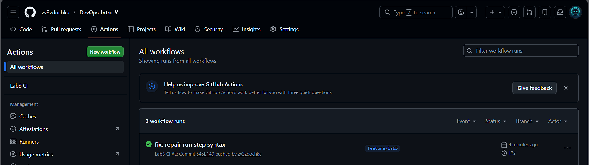
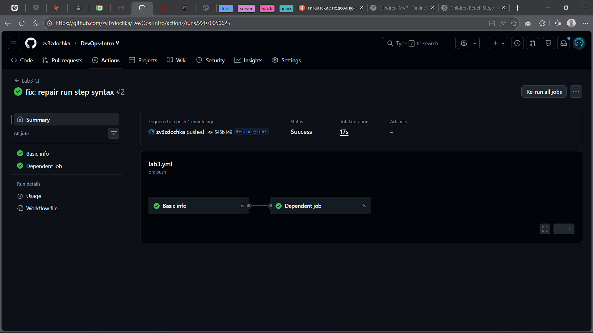
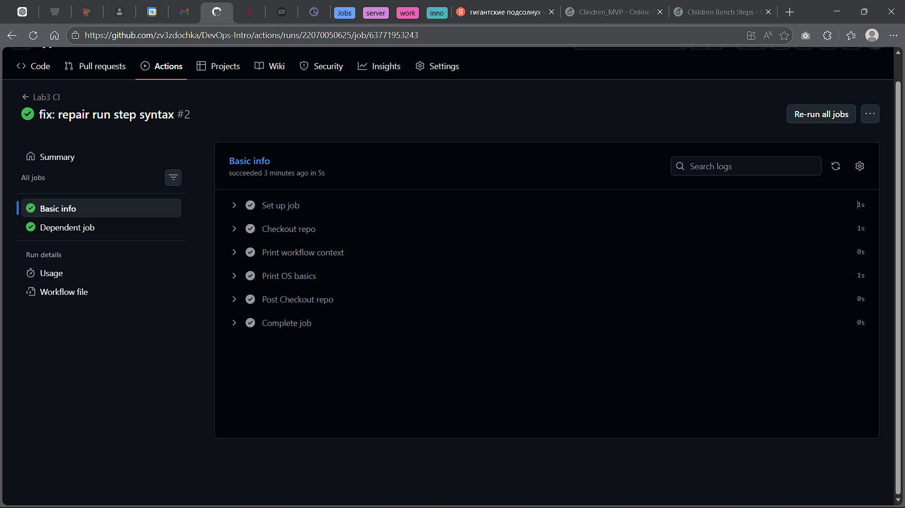
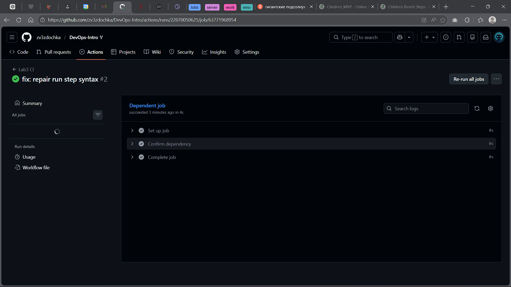

### What I did (Quickstart implementation)

- Created a workflow YAML file in `.github/workflows/` (`lab3.yml`).
- Configured the workflow to run on the `push` event.
- Defined two jobs:
  - `info` — prints workflow context and basic OS/tooling information.
  - `second-job` — runs only after `info` completes successfully (job dependency).

### Key concepts

- **Workflow**: an automation described in a YAML file stored under `.github/workflows/`.
- **Trigger / Event**: the condition that starts a workflow run (here: `on: push`).
- **Runner**: the execution environment (a GitHub-hosted VM) where jobs run (`ubuntu-latest`).
- **Job**: a set of steps executed on the same runner (here: `info`, `second-job`).
- **Step**: an individual action (`uses`) or shell command (`run`) executed inside a job.
- **Job dependency**: `needs: info` ensures `second-job` starts only after `info` succeeds.

### What triggered the run

The workflow run started automatically because I pushed a commit to branch `feature/lab3`, and the workflow is configured with the `push` trigger.

### Execution analysis

After the `push` event, GitHub Actions matched the workflow by `on: push`, provisioned a GitHub-hosted runner (`ubuntu-latest`) for the `info` job, and executed its steps sequentially (checkout → printing context → OS basics).  
Once `info` finished successfully, the dependency condition `needs: info` was satisfied, so `second-job` started and executed its step, confirming the job order via logs.

## Task 2 — Manual Trigger + System Information

### Changes made to the workflow
Workflow file: `.github/workflows/lab3.yml`

- Added a manual trigger via `workflow_dispatch`, so the workflow can be started from the GitHub UI (Actions → Lab3 CI → Run workflow).
- Added an additional step `Gather system information` inside the `info` job to collect detailed runner environment information (OS, CPU, memory, disk, network, tooling).

### Evidence (screenshots)

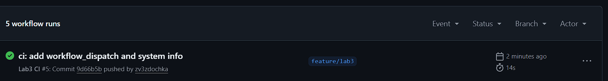
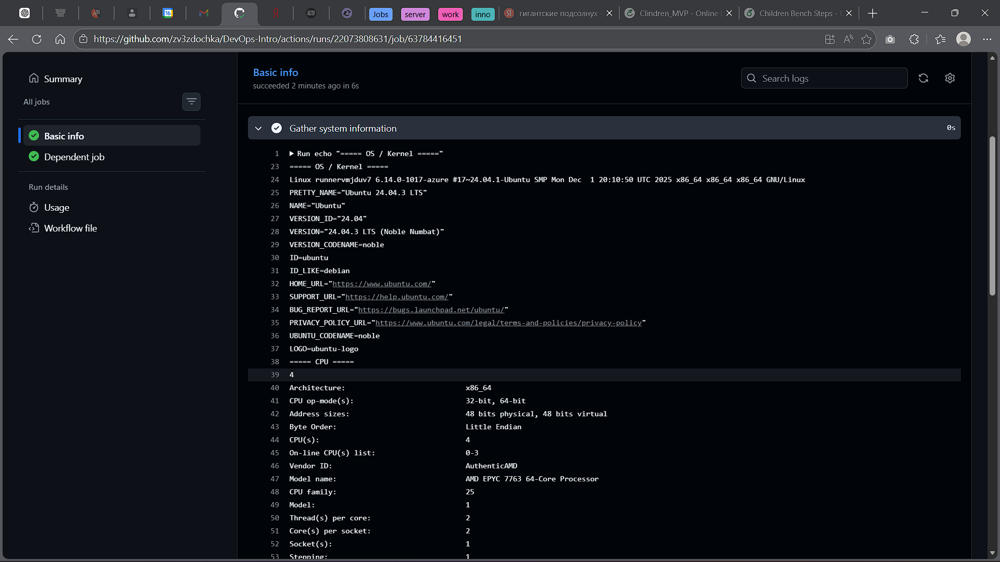
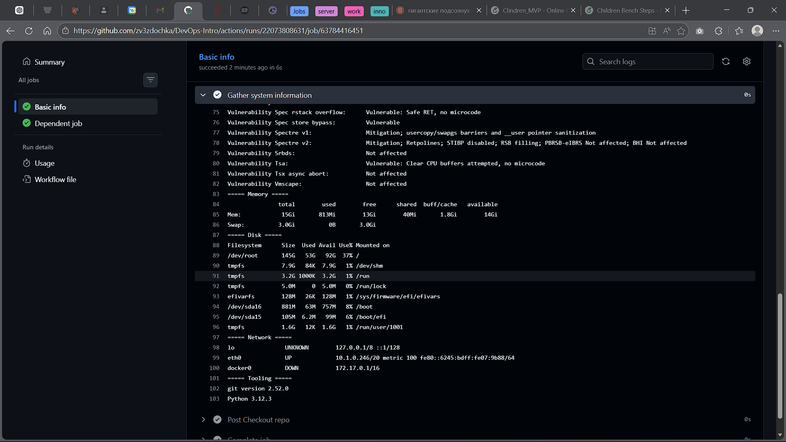
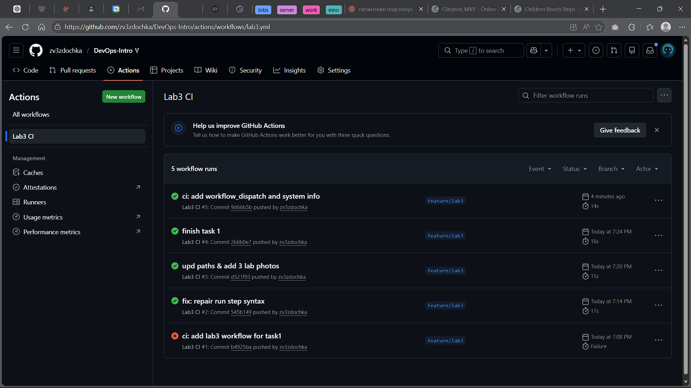
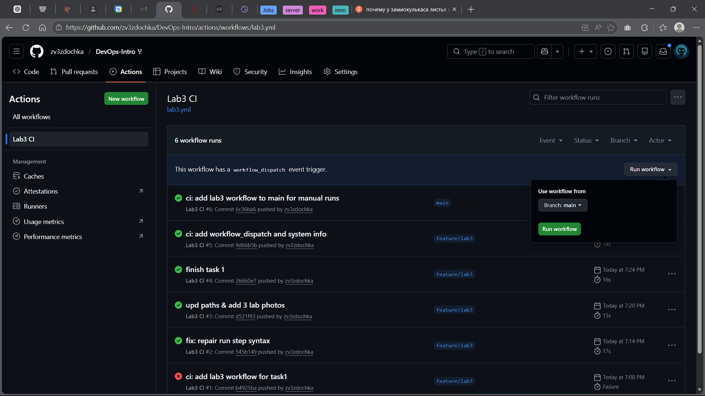
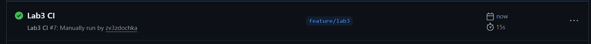
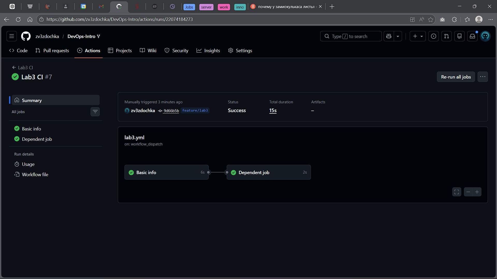

### Manual run link
https://github.com/zv3zdochka/DevOps-Intro/actions/runs/22074184273

### Gathered system information (runner)
The `Gather system information` step prints:
- **OS / Kernel**: `uname -a`, `/etc/os-release`
- **CPU**: `nproc`, `lscpu`
- **Memory**: `free -h`
- **Disk**: `df -h`
- **Network**: `ip -br a`
- **Tooling**: `git --version`, `python --version`

### Manual vs automatic triggers (comparison)
- **Automatic trigger (`push`)**: the workflow starts automatically on every push event that matches the workflow rules. It is useful for continuous integration: every change is verified immediately after being pushed.
- **Manual trigger (`workflow_dispatch`)**: the workflow starts only when the user explicitly launches it from the GitHub Actions UI. This is useful for ad-hoc runs: debugging, checking runner environment, re-running without new commits, and collecting diagnostics.

### Runner environment analysis
The workflow runs on a GitHub-hosted runner (`ubuntu-latest`). The runner environment is ephemeral: each run starts from a clean VM-like environment that already contains common Linux utilities and developer tooling. The collected system information confirms the available CPU cores, memory, disk space, and baseline OS/tooling versions, which is sufficient for typical CI tasks (build/test/lint). If the workflow needs additional dependencies, they must be installed explicitly within the job steps.
