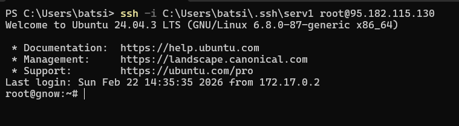

# Lab 4 — Operating System & Networking


During this lab, I've been using my own VPS server provided by HOSTVDS.

## Task 1 — Operating System Analysis


```bash
systemd-analyze
```

```
Startup finished in 3.072s (kernel) + 11.640s (userspace) = 14.713s
graphical.target reached after 9.486s in userspace.
```

```bash
systemd-analyze blame | head -n 25
```

```
35.313s apt-daily.service
31.193s apt-daily-upgrade.service
2.733s docker.service
2.128s systemd-journal-flush.service
2.123s cloud-init-local.service
2.029s logrotate.service
1.929s cloud-final.service
1.751s cloud-config.service
1.420s dev-vda1.device
1.247s systemd-networkd-wait-online.service
997ms certbot.service
996ms tuned.service
985ms cloud-init.service
921ms containerd.service
838ms gpu-manager.service
751ms accounts-daemon.service
635ms rsyslog.service
563ms ufw.service
405ms user@104.service
396ms man-db.service
396ms user@0.service
392ms systemd-udev-trigger.service
345ms mysql.service
344ms polkit.service
334ms fstrim.service
```

```bash
uptime
```

```
14:25:31 up 86 days, 8:06, 3 users, load average: 0.18, 0.11, 0.06
```

```bash
w
```

```
USER   TTY   FROM        LOGIN@   IDLE WHAT
root         172.17.0.XXX 14:24   86days sshd: root@pts/0
lightdm      -            28Nov25 86days lightdm --session-child
```

* Total boot time is **14.7 seconds**, indicating fast system initialization.
* The largest boot delays are caused by automatic package update services (`apt-daily`, `apt-daily-upgrade`).
* System load averages are very low (<0.2), showing minimal CPU utilization.
* The system has been running continuously for **86 days**, indicating stable uptime.


```bash
ps -eo pid,ppid,cmd,%mem,%cpu --sort=-%mem | head -n 6
```

```
PID     PPID CMD                         %MEM %CPU
2771591 ...  python3.12                  4.7  0.0
2771590 ...  python3.12                  4.7  0.0
2771588 ...  python3.12                  4.6  0.0
3605418 ...  python3.12                  4.5  0.0
241        1 systemd-journald            3.6  0.0
```

**Top memory-consuming process:** `python3.12` (highest `%MEM` in the snapshot, ~4.7%).

```bash
ps -eo pid,ppid,cmd,%mem,%cpu --sort=-%cpu | head -n 6
```

```
PID     PPID CMD                %MEM %CPU
3655872 547  sshd: root [priv]   0.2 10.1
3655873 ... sshd: root [net]     0.1 0.9
```

### Observations

* Multiple Python processes consume the largest portion of memory.
* SSH daemon temporarily shows the highest CPU usage due to active remote session handling.
* Background system processes maintain low CPU utilization.

---

```bash
systemctl list-dependencies | head -n 80
```

output truncated

```
default.target
├─accounts-daemon.service
├─lightdm.service
└─multi-user.target
 ├─docker.service
 ├─nginx.service
 ├─openvpn.service
 ├─ssh.service
 ├─systemd-networkd.service
 └─ufw.service
```

```bash
systemctl list-dependencies multi-user.target | head -n 120
```

output truncated

```
multi-user.target
├─docker.service
├─nginx.service
├─openvpn.service
├─ssh.service
├─rsyslog.service
├─systemd-networkd.service
└─timers.target
```

### Observations

* The system follows a standard Linux service hierarchy managed by `systemd`.
* Core infrastructure services include Docker, SSH, networking, logging, and firewall services.
* One dependency (`mysql.service`) appears inactive or failed, which may indicate unused or misconfigured service.

---

```bash
who -a
```

```
system boot 2025-11-28
run-level 5 2025-11-28
root pts/0 172.17.0.XXX still logged in
```

```bash
last -n 5
```

```
root pts/0 172.17.0.XXX still logged in
root pts/0 188.130.155.XXX Mon Feb 16
root pts/0 172.17.0.XXX Mon Feb 9
root pts/0 188.130.155.XXX Fri Feb 6
root pts/1 172.17.0.XXX Sun Feb 1
```

### Observations

* Remote access is performed via SSH sessions.
* Login history confirms repeated administrative access.
* No abnormal login patterns were observed.

---

```bash
free -h
```

```
Mem:   3.8Gi total, 1.3Gi used, 199Mi free, 2.6Gi buff/cache
Swap:  4.0Gi total, 194Mi used
```

```bash
cat /proc/meminfo | grep -e MemTotal -e SwapTotal -e MemAvailable
```

```
MemTotal:     4009884 kB
MemAvailable: 2608444 kB
SwapTotal:    4194300 kB
```

### Observations

* Significant portion of RAM is used as filesystem cache.
* Available memory (~2.5 GB) indicates no memory pressure.
* Swap usage is minimal, confirming efficient memory management.

---

## Resource Utilization Patterns

* CPU usage remains consistently low.
* Memory consumption is dominated by application-level Python processes.
* System services operate efficiently with stable long-term uptime.
* Cached memory usage improves disk I/O performance.

---

## Task 2 — Networking Analysis

---

```bash
traceroute github.com
```

```
traceroute to github.com (4.225.11.194), 30 hops max, 60 byte packets
 1  _gateway (95.182.115.XXX)  3.918 ms  3.817 ms  3.763 ms
 2  ae14-218.rt.rad.hki.fi.retn.net (87.245.244.XXX)  3.728 ms  3.683 ms  3.589 ms
 3  ae6-6.rt.tc1.sto.se.retn.net (87.245.233.XXX)  6.682 ms  6.608 ms *
 4  ae62-0.ier01.sto.ntwk.msn.net (104.44.47.XXX)  6.777 ms  7.990 ms ae60-0.ier02.sto.ntwk.msn.net (104.44.47.XXX)  6.683 ms
 5  ae21-0.ear02.sto31.ntwk.msn.net (104.44.239.XXX)  7.934 ms ae20-0.ear02.sto30.ntwk.msn.net (104.44.239.XXX)  7.848 ms  7.812 ms
 6  be-22-0.ibr02.sto31.ntwk.msn.net (104.44.22.XXX)  10.370 ms be-24-0.ibr01.sto30.ntwk.msn.net (104.44.22.XXX)  10.306 ms be-22-0.ibr02.sto31.ntwk.msn.net (104.44.22.XXX)  10.103 ms
 7  51.10.15.XXX (51.10.15.XXX)  10.054 ms  10.377 ms be-5-0.ibr01.gvx01.ntwk.msn.net (104.44.17.XXX)  9.681 ms
 8  51.10.45.XXX (51.10.45.XXX)  10.147 ms 51.10.15.XXX (51.10.15.XXX)  11.103 ms 51.10.36.XXX (51.10.36.XXX)  10.661 ms
 9  * 51.10.12.XXX (51.10.12.XXX)  11.711 ms 51.10.27.XXX (51.10.27.XXX)  10.961 ms
10  * * *
11  * * *
12  * * *
13  * * *
14  * * *
15  * * *
16  * * *
17  * * *
18  * * *
19  * * *
20  * * *
21  * * *
22  * * *
23  * * *
24  * * *
25  * * *
26  * * *
27  * * *
28  * * *
29  * * *
30  * * *
```

### Insights 

* The path reaches several upstream providers quickly (low latency ~4–12 ms for first ~9 hops).
* Many later hops return `* * *`, which typically indicates ICMP/UDP traceroute responses are filtered or rate-limited beyond a certain point (common in provider networks and cloud edges).
* Despite incomplete hop visibility, DNS resolution confirms GitHub is reachable and provides an IP (next section).


```bash
dig github.com
```

```
; <<>> DiG 9.18.39-0ubuntu0.24.04.2-Ubuntu <<>> github.com
;; global options: +cmd
;; Got answer:
;; ->>HEADER<<- opcode: QUERY, status: NOERROR, id: 16093
;; flags: qr rd ra; QUERY: 1, ANSWER: 1, AUTHORITY: 0, ADDITIONAL: 1

;; OPT PSEUDOSECTION:
; EDNS: version: 0, flags:; udp: 65494
;; QUESTION SECTION:
;github.com.                    IN      A

;; ANSWER SECTION:
github.com.             5       IN      A       4.225.11.194

;; Query time: 0 msec
;; SERVER: 127.0.0.53#53(127.0.0.53) (UDP)
;; WHEN: Sun Feb 22 14:35:18 UTC 2026
;; MSG SIZE  rcvd: 55
```

### Insights (DNS)

* DNS resolution succeeded with status `NOERROR` and returned an A record: `4.225.11.194`.
* The resolver used is `127.0.0.53` (systemd-resolved local stub), meaning queries are served via the local caching resolver.
* Query time is `0 ms`, consistent with cached responses or a fast local resolver path.


```bash
sudo timeout 10 tcpdump -c 5 -i any 'port 53' -nn
```

**Capture #1 (external DNS traffic to Cloudflare 1.1.1.1):**

```
tcpdump: data link type LINUX_SLL2
tcpdump: verbose output suppressed, use -v[v]... for full protocol decode
listening on any, link-type LINUX_SLL2 (Linux cooked v2), snapshot length 262144 bytes
14:35:25.520289 vethf7595f4 P   IP 172.17.0.XXX.59787 > 1.1.1.XXX.53: 6997+ A? download.jetbrains.com. (40)
14:35:25.520289 docker0 In  IP 172.17.0.XXX.59787 > 1.1.1.XXX.53: 6997+ A? download.jetbrains.com. (40)
14:35:25.520306 eth0  Out IP 95.182.115.XXX.59787 > 1.1.1.XXX.53: 6997+ A? download.jetbrains.com. (40)
14:35:25.528167 eth0  In  IP 1.1.1.XXX.53 > 95.182.115.XXX.59787: 6997 5/0/0 CNAME d1do0znm134sif.cloudfront.net., A 18.239.18.XXX, A 18.239.18.XXX, A 18.239.18.XXX, A 18.239.18.XXX (147)
14:35:25.528211 docker0 Out IP 1.1.1.XXX.53 > 172.17.0.XXX.59787: 6997 5/0/0 CNAME d1do0znm134sif.cloudfront.net., A 18.239.18.XXX, A 18.239.18.XXX, A 18.239.18.XXX, A 18.239.18.XXX (147)
5 packets captured
16 packets received by filter
0 packets dropped by kernel
```

**Capture #2 (local stub resolver traffic via 127.0.0.53):**

```
tcpdump: data link type LINUX_SLL2
tcpdump: verbose output suppressed, use -v[v]... for full protocol decode
listening on any, link-type LINUX_SLL2 (Linux cooked v2), snapshot length 262144 bytes
14:35:47.888747 lo    In  IP 127.0.0.XXX.57271 > 127.0.0.XXX.53: 65129+ [1au] A? google.com. (51)
14:35:47.889204 lo    In  IP 127.0.0.XXX.53 > 127.0.0.XXX.57271: 65129 1/0/1 A 172.217.21.XXX (55)
14:35:51.021425 lo    In  IP 127.0.0.XXX.49499 > 127.0.0.XXX.53: 25918+ [1au] A? google.com. (51)
14:35:51.021911 lo    In  IP 127.0.0.XXX.53 > 127.0.0.XXX.49499: 25918 1/0/1 A 172.217.21.XXX (55)
14:35:51.585157 lo    In  IP 127.0.0.XXX.44772 > 127.0.0.XXX.53: 43941+ [1au] A? google.com. (51)
5 packets captured
17 packets received by filter
0 packets dropped by kernel
```

### One example DNS query

Example query:

```
IP 95.182.115.XXX.59787 > 1.1.1.XXX.53: A? download.jetbrains.com.
```

### Analysis

* The tcpdump output shows a standard DNS exchange over UDP/53: an A-record query followed by a response containing records.
* Capture #1 demonstrates DNS from a container/bridge context (`veth*`, `docker0`) going out through the host interface (`eth0`) to a public resolver (1.1.1.1), and returning multiple A records + a CNAME (CDN-backed resolution via CloudFront).
* Capture #2 demonstrates the local systemd-resolved stub behavior: the client queries `127.0.0.53:53` on loopback, receives replies locally (often cached), hence very low response times.


```bash
dig -x 8.8.4.4
```

```
; <<>> DiG 9.18.39-0ubuntu0.24.04.2-Ubuntu <<>> -x 8.8.4.4
;; global options: +cmd
;; Got answer:
;; ->>HEADER<<- opcode: QUERY, status: NOERROR, id: 3567
;; flags: qr rd ra; QUERY: 1, ANSWER: 1, AUTHORITY: 0, ADDITIONAL: 1

;; QUESTION SECTION:
;4.4.8.8.in-addr.arpa.          IN      PTR

;; ANSWER SECTION:
4.4.8.8.in-addr.arpa.   71574   IN      PTR     dns.google.

;; Query time: 10 msec
;; SERVER: 127.0.0.53#53(127.0.0.53) (UDP)
;; WHEN: Sun Feb 22 14:36:03 UTC 2026
;; MSG SIZE  rcvd: 73
```

```bash
dig -x 1.1.2.2
```

```
; <<>> DiG 9.18.39-0ubuntu0.24.04.2-Ubuntu <<>> -x 1.1.2.2
;; global options: +cmd
;; Got answer:
;; ->>HEADER<<- opcode: QUERY, status: NXDOMAIN, id: 57000
;; flags: qr rd ra; QUERY: 1, ANSWER: 0, AUTHORITY: 1, ADDITIONAL: 1

;; QUESTION SECTION:
;2.2.1.1.in-addr.arpa.          IN      PTR

;; AUTHORITY SECTION:
1.in-addr.arpa.         2735    IN      SOA     ns.apnic.net. read-txt-record-of-zone-first-dns-admin.apnic.net. 23597 7200 1800 604800 3600

;; Query time: 10 msec
;; SERVER: 127.0.0.53#53(127.0.0.53) (UDP)
;; WHEN: Sun Feb 22 14:36:03 UTC 2026
;; MSG SIZE  rcvd: 137
```

### Comparison (Reverse lookup results)

* `8.8.4.4` returns a valid PTR record: `dns.google.` (Google public DNS reverse mapping exists).
* `1.1.2.2` returns `NXDOMAIN`, meaning no PTR record is defined for that address (not all IPs in a public range have reverse DNS configured).
* Both lookups were performed via the local stub resolver `127.0.0.53`.

---
