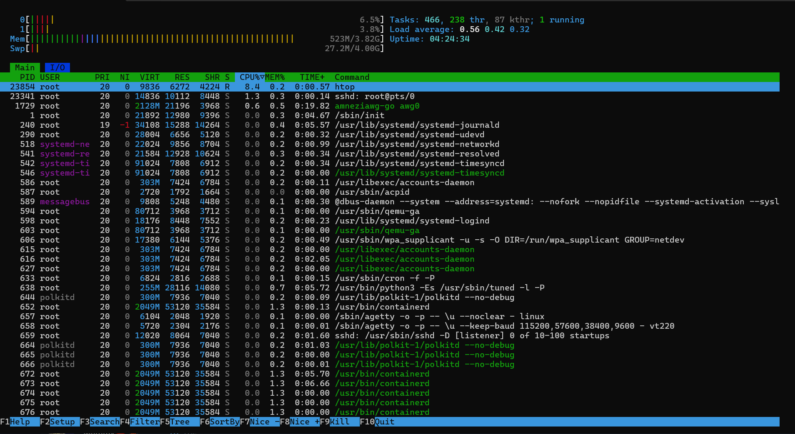
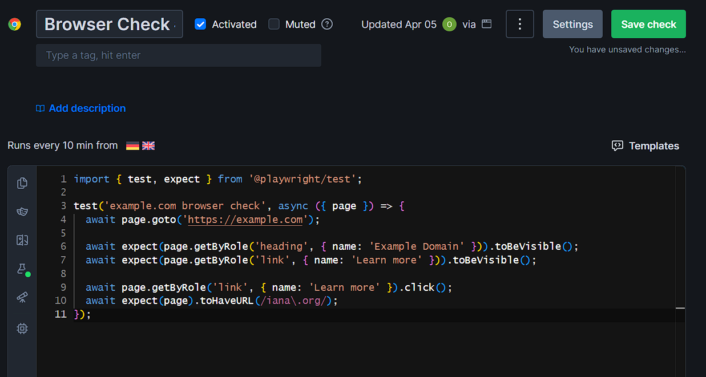
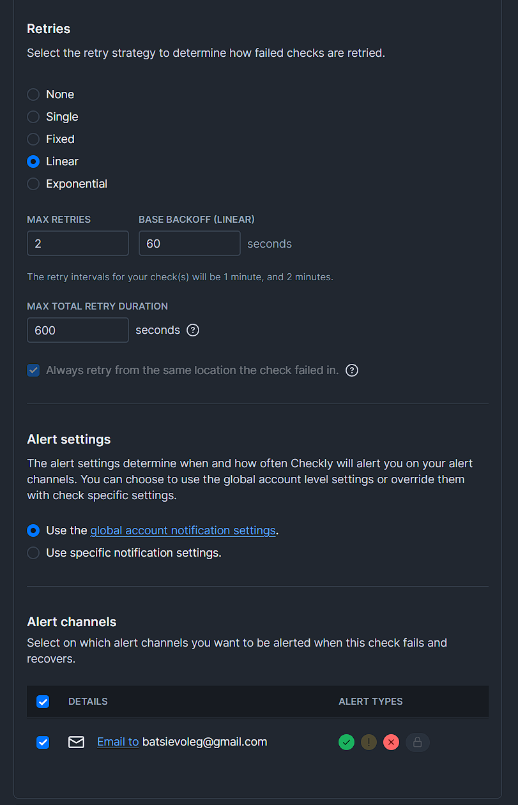
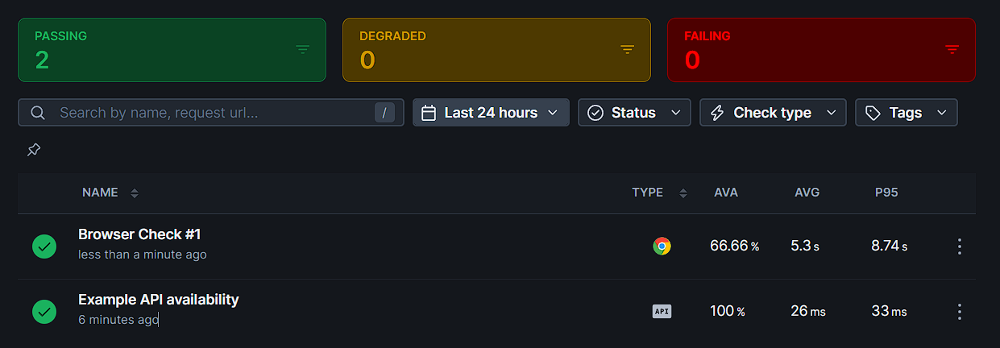

# Lab 8 — Site Reliability Engineering (SRE)

## Task 1 — Key Metrics for SRE and System Analysis

### 1.1 Monitor System Resources

I installed the required tools and used `htop`, `iostat`, `ps`, `iotop`, and `pidstat` to inspect CPU, memory, and disk I/O usage.

#### htop screenshot



#### Top resource consumers

I excluded the monitoring commands themselves (`ps`, `top`, `htop`, `iotop`) when interpreting the results, because they appeared in the output only due to the measurement process.

**Top CPU consumers**
1. `python` — about `50.1%` CPU
2. `python` — about `16.4%` CPU
3. `sshd` / `amneziawg-go` — low usage compared to the Python process, visible in `htop`

**Top memory consumers**
1. `lightdm-gtk-greeter` — `2.3%`
2. `Xorg` — `2.2%`
3. `python` — `2.2%`

**Top I/O consumers**
1. `jbd2/vda1-8` — main write activity, up to about `176.97 K/s`
2. `python3 /usr/sbin/iotop -b -n 3 -o` — small write activity caused by monitoring itself
3. No other meaningful I/O-heavy process was visible during the sampling window

#### Command outputs

**`top` overview**
```bash
top - 12:10:37 up  4:24,  2 users,  load average: 0.59, 0.42, 0.31
Tasks: 556 total,   2 running, 160 sleeping,   0 stopped, 394 zombie
%Cpu(s): 33.3 us, 11.1 sy,  0.0 ni, 55.6 id,  0.0 wa,  0.0 hi,  0.0 si,  0.0 st
MiB Mem :   3915.9 total,   1361.3 free,    787.4 used,   2018.5 buff/cache
MiB Swap:   4096.0 total,   4069.8 free,     26.2 used.   3128.5 avail Mem

PID   USER   %CPU  %MEM  COMMAND
23624 999    53.8   1.3  python
23671 root   15.4   0.2  top
1     root    0.0   0.3  systemd
...
````

**`iostat -x 1 5`**

```bash
avg-cpu:  %user   %nice %system %iowait  %steal   %idle
          10.87    0.00    1.19    0.02    1.24   86.67

Device            r/s     rkB/s   rrqm/s  %rrqm r_await rareq-sz     w/s     wkB/s   wrqm/s  %wrqm w_await wareq-sz ... aqu-sz  %util
vda              1.37    104.93     0.48  26.10    0.49    76.66    3.04     24.29     1.26  29.34    0.58     7.99 ...  0.01   0.11

avg-cpu:  %user   %nice %system %iowait  %steal   %idle
          23.38    0.00    1.49    1.00    1.99   72.14

Device            r/s   rkB/s ...     w/s   wkB/s   wrqm/s  %wrqm w_await wareq-sz ... aqu-sz  %util
vda              0.00   0.00  ...   434.00 7492.00   568.00  56.69    1.44    17.26 ...  0.62   2.90

avg-cpu:  %user   %nice %system %iowait  %steal   %idle
          24.75    0.00    0.51    0.00    1.52   73.23

Device            r/s   rkB/s ...  w/s  wkB/s ... aqu-sz  %util
vda              0.00   0.00  ... 0.00   0.00  ...  0.00   0.00
```

**Top CPU**

```bash
PID    USER   COMMAND   %CPU  %MEM
23673  root   ps        500   0.1
23624  999    python    50.1  2.0
23311  999    python    16.4  0.0
```

**Top memory**

```bash
PID   USER     COMMAND             %CPU  %MEM
979   lightdm  lightdm-gtk-greeter  0.0   2.3
702   root     Xorg                 0.0   2.2
1258  999      python               0.1   2.2
```

**Top I/O**

```bash
Total DISK READ:         0.00 B/s | Total DISK WRITE:       180.74 K/s
Current DISK READ:       0.00 B/s | Current DISK WRITE:     207.10 K/s
TID    PRIO  USER  DISK READ  DISK WRITE  SWAPIN  IO  COMMAND
173    be/3  root   0.00 B/s  176.97 K/s   ?      ?   [jbd2/vda1-8]
23696  be/4  root   0.00 B/s    3.77 K/s   ?      ?   python3 /usr/sbin/iotop -b -n 3 -o
...
```

**`pidstat -d 1 5`**

```bash
12:10:48        UID       PID   kB_rd/s   kB_wr/s kB_ccwr/s iodelay  Command
12:10:48          0       173      0.00      4.00      0.00       0  jbd2/vda1-8

Average:        UID       PID   kB_rd/s   kB_wr/s kB_ccwr/s iodelay  Command
Average:          0       173      0.00      0.79      0.00       0  jbd2/vda1-8
```

### 1.2 Disk Space Management

#### Disk usage

**`df -h`**

```bash
Filesystem      Size  Used Avail Use% Mounted on
tmpfs           392M  2.9M  389M   1% /run
/dev/vda1        38G   29G  7.1G  81% /
tmpfs           2.0G     0  2.0G   0% /dev/shm
tmpfs           5.0M     0  5.0M   0% /run/lock
tmpfs           392M   24K  392M   1% /run/user/104
overlay          38G   29G  7.1G  81% /var/lib/docker/overlay2/7f8eb131becd42371b25552fe818478ed52db904802283117eca6e29cc1b4283/merged
overlay          38G   29G  7.1G  81% /var/lib/docker/overlay2/bd7ddc78aa18e2c64eef05df9b02572e40467fcbd9ab9fb87aac3d73198eb395/merged
...
```

**`du -h /var | sort -rh | head -n 10`**

```bash
20G     /var
16G     /var/lib
11G     /var/lib/mysql
4.4G    /var/lib/docker
4.3G    /var/lib/docker/overlay2
3.8G    /var/log
3.6G    /var/lib/mysql/qzaem
3.5G    /var/log/journal/9b37eb03297c4e679754dbc30bbad89a
3.5G    /var/log/journal
624M    /var/lib/docker/overlay2/9gz0fy0szqnctb2rjjn83f1bi/diff
```

#### Largest files in `/var`

**`find /var -type f -exec du -h {} + | sort -rh | head -n 3`**

```bash
3.6G    /var/lib/mysql/qzaem/s_users.ibd
135M    /var/log/btmp.1
132M    /var/lib/docker/overlay2/uhefpypbo4ldtre2ox0t1razw/diff/general_model.keras
```

### Analysis

The system was not under constant heavy load at the time of measurement. The average load was low (`0.59`, `0.42`, `0.31`), and CPU idle time stayed high in `iostat`, so the machine still had free capacity. At the same time, one Python process clearly stood out as the main CPU consumer.

Memory pressure was also not critical. The machine had about 3.9 GiB of RAM in total, and a large part of memory was still available through free memory and buff/cache. The largest memory consumers were graphical processes like `lightdm-gtk-greeter` and `Xorg`, plus one Python process.

Disk I/O was generally low, but there was a short write burst on `vda`. The main visible writer was `jbd2/vda1-8`, which means most write activity was related to filesystem journaling rather than a user application doing large reads or writes.

The most important storage pattern is in `/var`. Most of the space is used by:

* MySQL data in `/var/lib/mysql`
* Docker data in `/var/lib/docker`
* system logs in `/var/log/journal`

Another important observation is that `top` showed `394 zombie` processes. This is unusual and suggests that some parent process is not properly cleaning up finished child processes, most likely related to Python workloads.

### Reflection

Based on these findings, I would optimize the system in several ways.

First, I would investigate the Python service that creates many zombie processes. This looks like the biggest reliability issue in the current state, because even if the system is not overloaded right now, zombie accumulation may indicate a process management bug.

Second, I would clean up disk usage in `/var`. I would review MySQL storage growth, check whether old data can be archived, and optimize large tables such as `s_users.ibd`. I would also remove unused Docker images, containers, and overlay layers.

Third, I would reduce log growth by configuring log rotation and checking whether journald retention limits should be tightened. The `/var/log/journal` directory already uses several gigabytes, so this can grow further if not controlled.

Finally, I would keep simple monitoring for CPU spikes, zombie process count, disk usage on `/`, and the growth of MySQL, Docker, and journald directories. These metrics would help catch problems earlier and improve system reliability.


## Task 2 — Practical Website Monitoring Setup

### 2.1 Chosen Website

For this task I chose the public website `https://example.com`.

I selected it because it is simple, stable, publicly accessible, and does not require authentication. This made it convenient for testing both basic availability and simple browser interactions.

### 2.2 Created Checks in Checkly

I created a free Checkly account and configured two checks for the selected website.

#### API Check

I created an API check called `Example API availability` with the following configuration:
- Method: `GET`
- URL: `https://example.com`
- Assertion: HTTP status code is `200`
- Frequency: every `10 minutes`

This check is used to confirm that the website is reachable and responds successfully.

#### Browser Check

I also created a browser check to verify page content and a basic user interaction.

The browser check does the following:
- opens `https://example.com`
- verifies that the heading `Example Domain` is visible
- verifies that the `Learn more` link is visible
- clicks the `Learn more` link
- checks that the browser is redirected to a URL containing `iana.org`

This check is more realistic than a simple availability check because it validates visible content and a user-facing interaction.

### 2.3 Alert Setup

I configured email notifications in Checkly and used alert settings for failed and recovered checks.

The browser check was configured with retries as shown in the settings:
- retry strategy: linear
- max retries: `2`
- base backoff: `60 seconds`

I used a `10 minute` interval because the selected website is static and public, so this frequency is enough to detect problems without creating too much alert noise.

### 2.4 Screenshots

#### Browser check configuration



#### Alert settings



#### Dashboard overview and successful check results



### Analysis

I chose these checks because they cover two different monitoring goals.

The API check confirms basic availability of the website. If the site is down or returns an unexpected status code, this check will fail immediately.

The browser check validates that the actual page content is loaded correctly and that a basic interaction works. This is important because a site may still return status code `200` even if the visible content is broken or an important element is missing.

The chosen threshold and interval are reasonable for this website. Since `example.com` is a simple public page, checking it every 10 minutes provides enough visibility while avoiding unnecessary alerts.

### Reflection

This monitoring setup helps maintain website reliability because it checks both technical availability and user-facing behavior.

The API check helps detect downtime quickly, while the browser check helps detect content or interaction issues that may affect users even when the server is still responding normally.

Email alerts make the setup practical because they allow the operator to react to failures and recoveries without constantly watching the dashboard.
