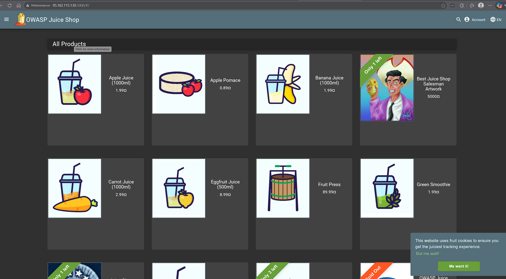
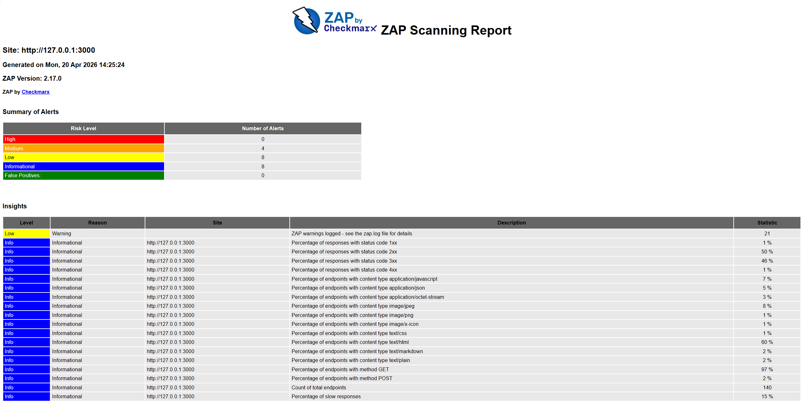
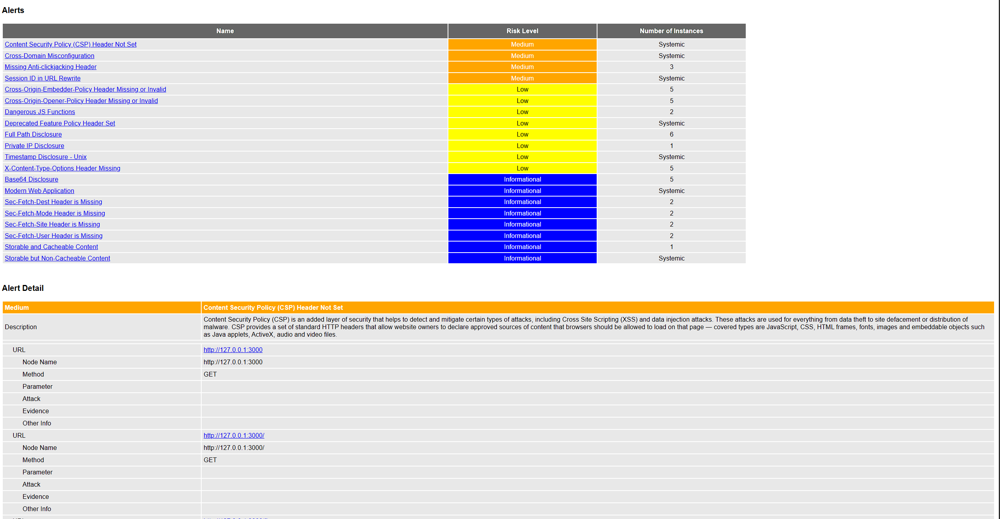

# Task 1 — Web Application Scanning with OWASP ZAP

## 1. Start the vulnerable application

I deployed OWASP Juice Shop on my Linux VPS with Docker.

### Command

```bash
docker run -d --name juice-shop -p 3000:3000 bkimminich/juice-shop
````

### Output

```text
9248a5eed1c5595fbe3e239f3c7aa9dfabbf7f572fc661691e426d4607b72c6a
```

After that I opened the application in the browser:

```text
http://95.182.115.130:3000
```

The page opened correctly and Juice Shop was running.


## 2. Verify that the application is running

I also checked it locally on the VPS.

### Command

```bash
curl -I http://127.0.0.1:3000
```

### Output

```text
HTTP/1.1 200 OK
Access-Control-Allow-Origin: *
X-Content-Type-Options: nosniff
X-Frame-Options: SAMEORIGIN
Feature-Policy: payment 'self'
X-Recruiting: /#/jobs
Accept-Ranges: bytes
Cache-Control: public, max-age=0
Last-Modified: Mon, 20 Apr 2026 14:03:27 GMT
ETag: W/"124fa-19dab3407d2"
Content-Type: text/html; charset=UTF-8
Content-Length: 75002
Vary: Accept-Encoding
Date: Mon, 20 Apr 2026 14:03:34 GMT
Connection: keep-alive
Keep-Alive: timeout=5
```

## 3. Run OWASP ZAP baseline scan

For Linux I used the host network mode, because this worked correctly on the VPS and allowed ZAP to scan the local application.

### Command

```bash
cd ~/lab9/task1
docker run --rm --network host -v "$(pwd)":/zap/wrk:rw \
-t ghcr.io/zaproxy/zaproxy:stable zap-baseline.py \
-t http://127.0.0.1:3000 \
-j \
-a \
-m 5 \
-r zap-report-host.html | tee zap-host-output.txt
```

### Output

```text
Using the Automation Framework
Total of 166 URLs
PASS: Vulnerable JS Library (Powered by Retire.js) [10003]
PASS: In Page Banner Information Leak [10009]
PASS: Cookie No HttpOnly Flag [10010]
PASS: Cookie Without Secure Flag [10011]
PASS: Re-examine Cache-control Directives [10015]
PASS: Cross-Domain JavaScript Source File Inclusion [10017]
PASS: Content-Type Header Missing [10019]
PASS: Information Disclosure - Debug Error Messages [10023]
PASS: Information Disclosure - Sensitive Information in URL [10024]
PASS: Information Disclosure - Sensitive Information in HTTP Referrer Header [10025]
PASS: HTTP Parameter Override [10026]
PASS: Information Disclosure - Suspicious Comments [10027]
PASS: Off-site Redirect [10028]
PASS: Cookie Poisoning [10029]
PASS: User Controllable Charset [10030]
PASS: User Controllable HTML Element Attribute (Potential XSS) [10031]
PASS: Viewstate [10032]
PASS: Directory Browsing [10033]
PASS: Heartbleed OpenSSL Vulnerability (Indicative) [10034]
PASS: Strict-Transport-Security Header [10035]
PASS: HTTP Server Response Header [10036]
PASS: Server Leaks Information via "X-Powered-By" HTTP Response Header Field(s) [10037]
PASS: X-Backend-Server Header Information Leak [10039]
PASS: Secure Pages Include Mixed Content [10040]
PASS: HTTP to HTTPS Insecure Transition in Form Post [10041]
PASS: HTTPS to HTTP Insecure Transition in Form Post [10042]
PASS: User Controllable JavaScript Event (XSS) [10043]
PASS: Big Redirect Detected (Potential Sensitive Information Leak) [10044]
PASS: Retrieved from Cache [10050]
PASS: X-ChromeLogger-Data (XCOLD) Header Information Leak [10052]
PASS: Cookie without SameSite Attribute [10054]
PASS: CSP [10055]
PASS: X-Debug-Token Information Leak [10056]
PASS: Username Hash Found [10057]
PASS: X-AspNet-Version Response Header [10061]
PASS: PII Disclosure [10062]
PASS: Hash Disclosure [10097]
PASS: Source Code Disclosure [10099]
PASS: Weak Authentication Method [10105]
PASS: Reverse Tabnabbing [10108]
PASS: Authentication Request Identified [10111]
PASS: Session Management Response Identified [10112]
PASS: Verification Request Identified [10113]
PASS: Script Served From Malicious Domain (polyfill) [10115]
PASS: ZAP is Out of Date [10116]
PASS: Absence of Anti-CSRF Tokens [10202]
PASS: Script Passive Scan Rules [50001]
PASS: Stats Passive Scan Rule [50003]
PASS: Insecure JSF ViewState [90001]
PASS: Java Serialization Object [90002]
PASS: Sub Resource Integrity Attribute Missing [90003]
PASS: Charset Mismatch [90011]
PASS: Application Error Disclosure [90022]
PASS: WSDL File Detection [90030]
PASS: Loosely Scoped Cookie [90033]
WARN-NEW: Missing Anti-clickjacking Header [10020] x 3
        http://127.0.0.1:3000/socket.io/?EIO=4&transport=polling&t=PshHHh_&sid=TKRGnI0nC0nMsUTFAAAE (200 OK)
        http://127.0.0.1:3000/socket.io/?EIO=4&transport=polling&t=PshHI9p&sid=TKRGnI0nC0nMsUTFAAAE (200 OK)
        http://127.0.0.1:3000/socket.io/?EIO=4&transport=polling&t=PshHIf9&sid=TKRGnI0nC0nMsUTFAAAE (200 OK)
WARN-NEW: X-Content-Type-Options Header Missing [10021] x 5
        http://127.0.0.1:3000/socket.io/?EIO=4&transport=polling&t=PshHHiH&sid=TKRGnI0nC0nMsUTFAAAE (200 OK)
        http://127.0.0.1:3000/socket.io/?EIO=4&transport=polling&t=PshHHM3 (200 OK)
        http://127.0.0.1:3000/socket.io/?EIO=4&transport=polling&t=PshHHh_&sid=TKRGnI0nC0nMsUTFAAAE (200 OK)
        http://127.0.0.1:3000/socket.io/?EIO=4&transport=polling&t=PshHI9p&sid=TKRGnI0nC0nMsUTFAAAE (200 OK)
        http://127.0.0.1:3000/socket.io/?EIO=4&transport=polling&t=PshHIf9&sid=TKRGnI0nC0nMsUTFAAAE (200 OK)
WARN-NEW: Content Security Policy (CSP) Header Not Set [10038] x 5
        http://127.0.0.1:3000 (200 OK)
        http://127.0.0.1:3000/ (200 OK)
        http://127.0.0.1:3000/ftp (200 OK)
        http://127.0.0.1:3000/ftp/coupons_2013.md.bak (403 Forbidden)
        http://127.0.0.1:3000/sitemap.xml (200 OK)
WARN-NEW: Storable and Cacheable Content [10049] x 6
        http://127.0.0.1:3000/robots.txt (200 OK)
        http://127.0.0.1:3000 (200 OK)
        http://127.0.0.1:3000/assets/public/favicon_js.ico (200 OK)
        http://127.0.0.1:3000/chunk-24EZLZ4I.js (200 OK)
WARN-NEW: Deprecated Feature Policy Header Set [10063] x 5
        http://127.0.0.1:3000 (200 OK)
        http://127.0.0.1:3000/chunk-24EZLZ4I.js (200 OK)
        http://127.0.0.1:3000/chunk-4MIYPPGW.js (200 OK)
        http://127.0.0.1:3000/chunk-T3PSKZ45.js (200 OK)
        http://127.0.0.1:3000/sitemap.xml (200 OK)
WARN-NEW: Base64 Disclosure [10094] x 5
        http://127.0.0.1:3000/ftp (200 OK)
        http://127.0.0.1:3000/ftp/ (200 OK)
        http://127.0.0.1:3000/ftp/quarantine (200 OK)
        http://127.0.0.1:3000/main.js (200 OK)
        http://127.0.0.1:3000/rest/continue-code (200 OK)
WARN-NEW: Timestamp Disclosure - Unix [10096] x 5
        http://127.0.0.1:3000 (200 OK)
        http://127.0.0.1:3000 (200 OK)
        http://127.0.0.1:3000 (200 OK)
        http://127.0.0.1:3000/sitemap.xml (200 OK)
        http://127.0.0.1:3000/sitemap.xml (200 OK)
WARN-NEW: Cross-Domain Misconfiguration [10098] x 5
        http://127.0.0.1:3000 (200 OK)
        http://127.0.0.1:3000/assets/public/favicon_js.ico (200 OK)
        http://127.0.0.1:3000/robots.txt (200 OK)
        http://127.0.0.1:3000/sitemap.xml (200 OK)
        http://127.0.0.1:3000/styles.css (200 OK)
WARN-NEW: Modern Web Application [10109] x 5
        http://127.0.0.1:3000 (200 OK)
        http://127.0.0.1:3000/ (200 OK)
        http://127.0.0.1:3000/juice-shop/build/routes/fileServer.js:43:13 (200 OK)
        http://127.0.0.1:3000/juice-shop/build/routes/fileServer.js:59:18 (200 OK)
        http://127.0.0.1:3000/sitemap.xml (200 OK)
WARN-NEW: Dangerous JS Functions [10110] x 2
        http://127.0.0.1:3000/chunk-LHKS7QUN.js (200 OK)
        http://127.0.0.1:3000/main.js (200 OK)
WARN-NEW: Full Path Disclosure [110009] x 6
        http://127.0.0.1:3000/ftp/coupons_2013.md.bak (403 Forbidden)
        http://127.0.0.1:3000/ftp/eastere.gg (403 Forbidden)
        http://127.0.0.1:3000/ftp/encrypt.pyc (403 Forbidden)
        http://127.0.0.1:3000/ftp/package-lock.json.bak (403 Forbidden)
        http://127.0.0.1:3000/ftp/package.json.bak (403 Forbidden)
WARN-NEW: Private IP Disclosure [2] x 1
        http://127.0.0.1:3000/rest/admin/application-configuration (200 OK)
WARN-NEW: Session ID in URL Rewrite [3] x 5
        http://127.0.0.1:3000/socket.io/?EIO=4&transport=polling&t=PshHHiH&sid=TKRGnI0nC0nMsUTFAAAE (200 OK)
        http://127.0.0.1:3000/socket.io/?EIO=4&transport=websocket&sid=TKRGnI0nC0nMsUTFAAAE (101 Switching Protocols)
        http://127.0.0.1:3000/socket.io/?EIO=4&transport=polling&t=PshHHh_&sid=TKRGnI0nC0nMsUTFAAAE (200 OK)
        http://127.0.0.1:3000/socket.io/?EIO=4&transport=polling&t=PshHI9p&sid=TKRGnI0nC0nMsUTFAAAE (200 OK)
        http://127.0.0.1:3000/socket.io/?EIO=4&transport=polling&t=PshHIf9&sid=TKRGnI0nC0nMsUTFAAAE (200 OK)
WARN-NEW: Cross-Origin-Embedder-Policy Header Missing or Invalid [90004] x 10
        http://127.0.0.1:3000 (200 OK)
        http://127.0.0.1:3000/ (200 OK)
        http://127.0.0.1:3000/ftp (200 OK)
        http://127.0.0.1:3000/juice-shop/build/routes/fileServer.js:59:18 (200 OK)
        http://127.0.0.1:3000/sitemap.xml (200 OK)
WARN-NEW: Sec-Fetch-Dest Header is Missing [90005] x 8
        http://127.0.0.1:3000 (200 OK)
        http://127.0.0.1:3000/robots.txt (200 OK)
        http://127.0.0.1:3000 (200 OK)
        http://127.0.0.1:3000/robots.txt (200 OK)
        http://127.0.0.1:3000 (200 OK)
FAIL-NEW: 0     FAIL-INPROG: 0  WARN-NEW: 15    WARN-INPROG: 0  INFO: 0 IGNORE: 0       PASS: 55
```

I also checked that the HTML report was created.

### Command

```bash
ls -lh zap-host-output.txt zap-report-host.html
```

### Output

```text
-rw-r--r-- 1 root root 7.2K Apr 20 14:25 zap-host-output.txt
-rw-r--r-- 1 1000 1000 149K Apr 20 14:25 zap-report-host.html
```

## 4. ZAP HTML report overview




## 5. Results

### Number of Medium risk vulnerabilities found

According to the HTML report, ZAP found **4 Medium risk vulnerabilities**.

### Two most interesting vulnerabilities

#### 1. Content Security Policy (CSP) Header Not Set

This means the application does not define a Content Security Policy.
CSP helps the browser understand which scripts and resources are trusted.
If it is missing, the site is more exposed to XSS and content injection problems.

#### 2. Session ID in URL Rewrite

This means a session identifier appears in the URL.
This is dangerous because URLs can be saved in browser history, logs, and proxy records.
If someone gets that URL, they may get access to the session.

### Other Medium findings from the report

* Cross-Domain Misconfiguration
* Missing Anti-clickjacking Header

## 6. Security headers status

### Present headers

From the local response check I saw these headers:

* `X-Content-Type-Options: nosniff`
* `X-Frame-Options: SAMEORIGIN`
* `Feature-Policy: payment 'self'`
* `Access-Control-Allow-Origin: *`

### Missing or problematic headers

From the ZAP report I saw these missing or inconsistent headers:

* `Content-Security-Policy` was not set
* Anti-clickjacking header was missing on some responses
* `X-Content-Type-Options` was missing on some responses
* `Cross-Origin-Embedder-Policy` was missing or invalid on some responses
* `Sec-Fetch-Dest` header was missing on some responses

### Why they matter

These headers help protect the application from common browser-based attacks.
For example, CSP helps reduce XSS risk, anti-clickjacking headers help protect against UI redressing, and `X-Content-Type-Options` helps stop MIME-type confusion.

## 7. Most interesting vulnerability

The most interesting vulnerability for me was **Session ID in URL Rewrite**.
I think it is important because session data should not be visible in URLs. It can easily leak through logs, browser history, or copied links.

## 8. Analysis

In this scan, the most common problems were security misconfigurations and missing protection headers.
I think this is common in real web applications too, especially in modern JavaScript apps with many endpoints and different responses.
Even when the main page looks fine, some internal routes or socket endpoints may still miss important protections.

Web vulnerabilities are often not only about SQL injection or XSS payloads.
Very often the problem is weak configuration, missing headers, unsafe session handling, and too much exposed technical information.

## 9. Cleanup

### Command

```bash
docker stop juice-shop && docker rm juice-shop
```


